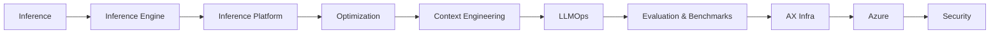
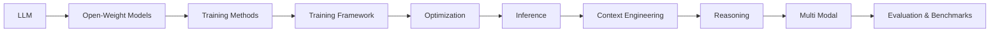
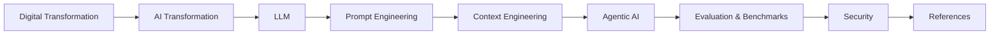
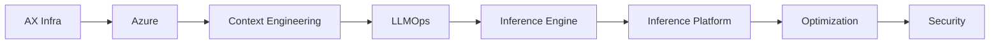
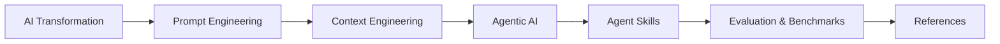

# ALL ABOUT LLM

LLM(Large Language Model)에 대한 모든 것을 다루는 레포입니다.

## 목적

LLM 기술이 발전함에 따라 LLM을 활용한 서비스들이 많이 출시되고 있습니다. 이 레포는 LLM 서비스를 구축하기 위해 알아두면 좋은 지식들을 누구나 쉽게 얻을 수 있도록 돕기 위해 만들어졌습니다.

## 독자별 추천 읽기 순서

LLM 생태계의 다양한 역할에 맞추어, 어떤 순서로 문서를 확인하면 좋을지 안내해 드립니다.

### 1. API 기반 AI 애플리케이션 개발자
OpenAI, Anthropic 등 SaaS API를 활용해 빠르게 서비스나 자율 에이전트를 구축하는 분들을 위한 순서입니다.


### 2. 로컬 LLM 기반 애플리케이션 개발자
Llama, DeepSeek 등 오픈 웨이트 모델을 로컬 환경에 직접 구축하고 최적화하여 독자적인 서비스를 운영하려는 분들을 위한 순서입니다.

```mermaid
flowchart LR
    A[Open-Weight Models] --> B[Inference Engine]
    B --> C[Inference]
    C --> D[Optimization]
    D --> E[Prompt Engineering]
    E --> F[Context Engineering]
    F --> G[RAG]
    G --> H[Tool Call]
    H --> I[MCP]
    I --> J[Agent Skills]
    J --> K[Agent]
    K --> L[Agent Framework]
    L --> M[Agentic AI]
```



### 3. MLOps 및 서빙 엔지니어
학습된 모델을 프로덕션 환경에 최적화하여 배포하고 운영하는 분들을 위한 순서입니다.



### 4. 모델 연구원 및 엔지니어
새로운 파운데이션 모델을 학습시키거나 파인튜닝하는 연구 개발자를 위한 순서입니다.



### 5. PM 및 IT 기획자
LLM 기반 비즈니스를 기획하거나 기술 트렌드를 읽으려는 리더를 위한 순서입니다.



### 6. DevOps / 인프라 엔지니어
AI 서비스의 프로덕션 인프라를 설계·구축·운영하는 분들을 위한 순서입니다.



### 7. AI 서비스 디자이너 / UX 설계자
AI 기반 사용자 경험을 설계하고, 에이전트와 사용자 간의 인터랙션 패턴을 설계하는 분들을 위한 순서입니다.



## 목차

- [디지털 전환 (DX)](./docs/dx/)
- [AI Transformation (AX)](./docs/ax/)
- [AI Transformation 인프라 (AX Infra)](./docs/ax-infra/)
- [LLM](./docs/LLM/)
- [Training Methods](./docs/training_methods/)
- [Training Framework](./docs/training_framework/)
- [Optimization](./docs/optimization/)
- [Inference](./docs/inference/)
- [Serving (Inference Engine)](./docs/inference_engine/)
- [추론 플랫폼 (Inference Platform)](./docs/inference_platform/)
- [Prompt Engineering](./docs/prompt_engineering/)
- [Context Engineering](./docs/context_engineering/)
- [문서 파싱 (Document Parsing)](./docs/document_parsing/)
- [RAG](./docs/RAG/)
- [Agentic AI](./docs/agentic_ai/)
- [Agent](./docs/agent/)
- [Tool Call](./docs/tool_call/)
- [Agent Framework](./docs/agent_framework/)
- [Agent Harness](./docs/agent_harness/)
- [Multi Modal](./docs/multi_modal/)
- [Reasoning](./docs/reasoning/)
- [Evaluation & Benchmarks](./docs/evaluation/)
- [LLMOps](./docs/llmops/)
- [Security](./docs/security/)
- [MCP (Model Context Protocol)](./docs/mcp/)
- [Agent Skills](./docs/skills/)
- [Open Source Project](./docs/open_source_project/)
- [오픈 웨이트 모델 (Open-Weight Models)](./docs/open_weight_models/)
- [Agentic Coding Assistant](./docs/coding_assistant/)
- [References (참조 자료)](./docs/references/)
- [개발 가이드](./docs/development.md)

## 개발 환경 설정

### Python 코드 포맷팅 (Black)

이 프로젝트는 [Black](https://black.readthedocs.io/)을 사용하여 Python 코드를 자동으로 포맷팅합니다.

#### 자동 설정 (권장)
```bash
python setup_black.py
```

#### 수동 설정
1. 필요한 패키지 설치:
   ```bash
   pip install -r requirements.txt
   ```

2. pre-commit hooks 설치:
   ```bash
   pre-commit install
   ```

3. VS Code 확장 프로그램 설치:
   - Python
   - Black Formatter
   - isort
   - Flake8

#### 사용법
- **자동 포맷팅**: VS Code에서 파일 저장 시 자동 적용
- **수동 포맷팅**: `black <파일명>` 또는 `black .`
- **Git commit 시**: pre-commit hooks가 자동으로 실행
