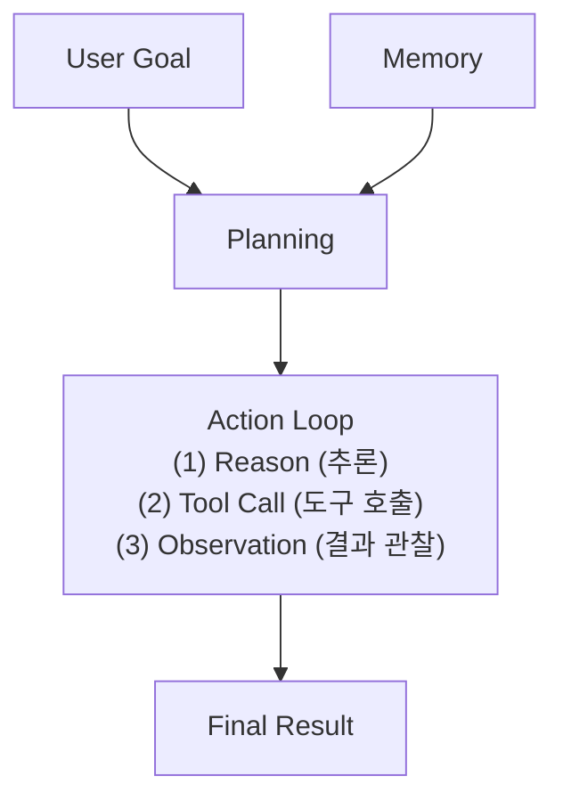

# 에이전트 아키텍처 (Core Pillars)

에이전트를 구성하는 4대 핵심 요소는 보통 **Planning(계획), Memory(기억), Tools(도구), Action(실행)**으로 나뉩니다.

## 1. Planning (계획 및 추론)
에이전트가 복잡한 목표를 수행 가능한 작은 단계로 나누는 과정입니다.

- **Task Decomposition**: 큰 문제를 작은 하위 작업(Sub-tasks)으로 분해합니다.
- **Reasoning 기법**:
    - **Chain-of-Thought (CoT)**: 단계별로 생각하며 논리적 오류를 줄입니다.
    - **Tree-of-Thought (ToT)**: 여러 가능한 경로를 탐색하고 최적의 경로를 선택합니다.
    - **ReAct (Reason + Act)**: 추론(Reason)과 실행(Action)을 한 루프 안에서 결합하여 실시간으로 계획을 수정합니다.

## 2. Memory (기억)
에이전트가 과거의 경험과 현재의 상태를 유지하는 방식입니다.

- **Short-term Memory**: 현재 대화나 세션 내의 상태(State)를 관리합니다. (예: LangGraph의 `State`)
- **Long-term Memory**: 
    - **Vector Storage (RAG)**: 방대한 데이터를 검색하여 필요한 정보를 인출합니다.
    - **Episodic Memory**: 과거의 성공/실패 사례를 기억하여 유사한 상황에서 더 나은 결정을 내리게 합니다.

## 3. Tools & Resources (도구 및 자원)
에이전트가 LLM의 텍스트 생성 능력을 넘어 외부 세계와 상호작용하는 수단입니다.

- **Function Calling**: 사전에 정의된 함수를 모델이 필요할 때 호출하는 기술입니다.
- **MCP (Model Context Protocol)**: 2024년 말 등장한 표준 프로토콜로, 다양한 데이터 소스(GitHub, Postgres, Slack 등)를 에이전트가 일관된 방식으로 연결하게 해줍니다.
- **Browsing & Code Execution**: 웹을 탐색하거나 직접 파이썬 코드를 작성하고 실행하여 결과를 얻습니다.

## 4. Action (실행)
계획된 작업을 실제 결과로 변환하는 단계입니다.

- **Action Loop**: 에이전트가 도구를 호출하고 결과를 받아 다시 추론하는 순환 과정을 거칩니다.
- **Environment Interaction**: 파일 시스템 수정, 이메일 전송, 데이터베이스 업데이트 등 실제 환경에 영향을 미치는 작업입니다.

---

### 아키텍처 요약 다이어그램 (개념도)

