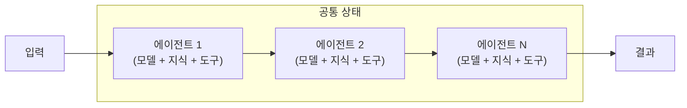
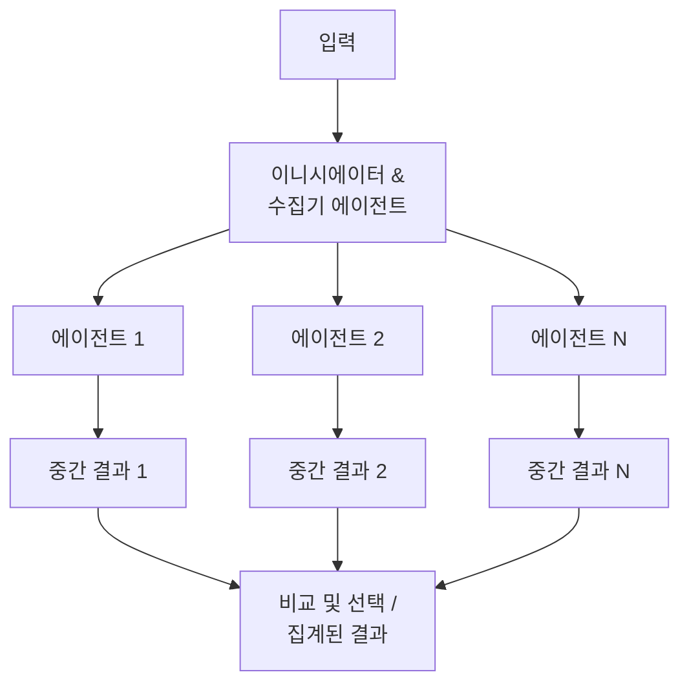
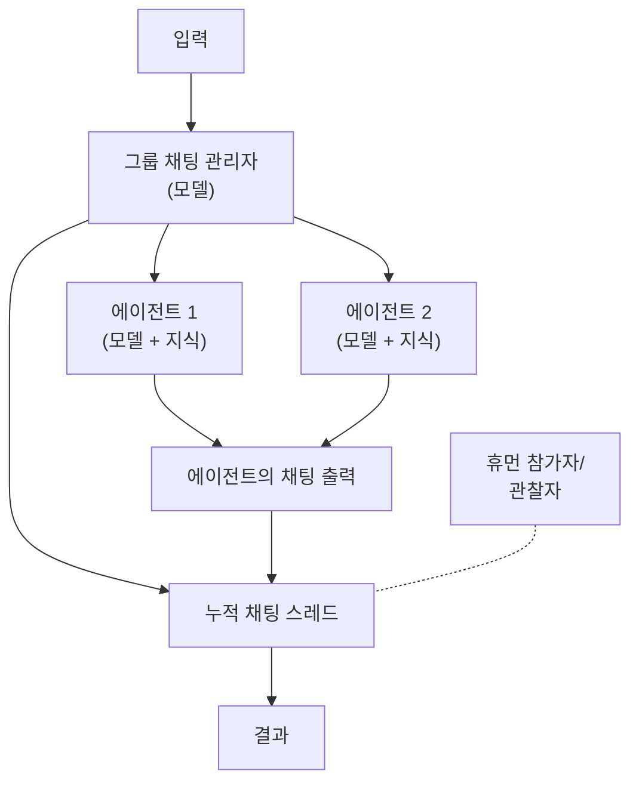
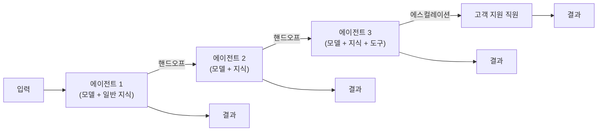
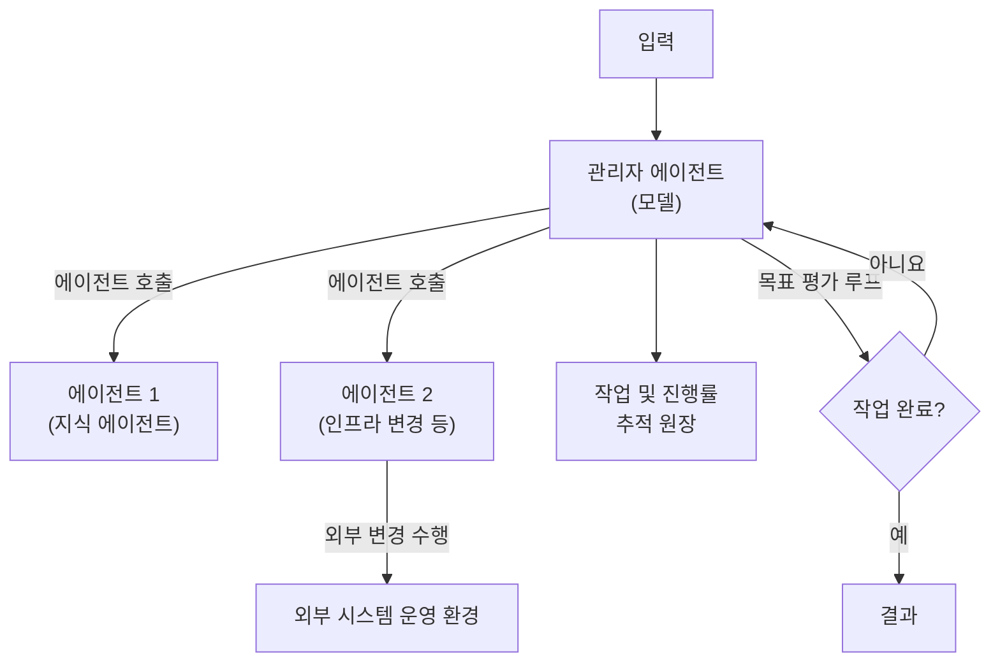

# AI 에이전트 오케스트레이션 패턴

설계자와 개발자가 언어 모델 기능을 최대한 활용하도록 워크로드를 설계함에 따라 AI 에이전트 시스템은 점점 더 복잡해지고 있습니다. 이 가이드에서는 **단일 에이전트의 내부 설계 패턴**부터 **다중 에이전트 오케스트레이션 패턴**까지 체계적으로 설명하고, 특정 요구 사항에 맞는 접근 방식을 선택하는 데 도움을 제공합니다.

---

## 1. AI 에이전트 오케스트레이션의 이해

**AI 에이전트 오케스트레이션(AI Agent Orchestration)**은 공유된 목표를 효율적으로 달성하기 위해 통합 시스템 내에서 여러 전문 AI 에이전트를 조정하는 프로세스입니다. 단일의 범용 AI 솔루션에 의존하는 대신, 복잡한 워크플로와 프로세스를 자동화하기 위해 특정 작업용으로 설계된 에이전트 네트워크를 활용합니다. 오케스트레이션은 마치 오케스트라 지휘자처럼 전문화된 에이전트들의 상호작용을 관리하여 올바른 에이전트가 적시에 활성화되도록 동기화합니다.

### 제너레이티브 AI와 에이전틱 AI

AI 어시스턴트는 규칙 기반 챗봇에서 시작해 제너레이티브 AI 및 대규모 언어 모델(LLM) 기반의 어시스턴트로 발전했습니다. **제너레이티브 AI(Generative AI)**는 사용자의 프롬프트에 기반해 텍스트, 이미지 등의 콘텐츠를 생성하는 능력을 의미합니다. 이 진화의 최상단에는 **에이전틱 AI(Agentic AI)**가 존재합니다. 에이전틱 AI는 최소한의 감독 하에 의사 결정을 내리고, 워크플로를 설계하며, 자체 지식의 공백을 메우기 위해 함수 호출(Function calling)로 외부 도구(API, 웹 검색, 데이터베이스, 다른 에이전트 등)와 자율적으로 상호작용합니다.

### 오케스트레이션의 중요성

AI 시스템이 발전함에 따라 복잡한 작업을 처리하는 데 있어 단일 AI 모델이나 단일 에이전트만으로는 불충분한 경우가 많습니다. 자율 시스템들은 종종 다양한 클라우드 및 애플리케이션 환경 위에 구축되므로 상호 협업에 어려움을 겪고 프로세스가 단절되는 사일로(Silo) 현상을 겪게 됩니다. 오케스트레이션은 이러한 격차를 해소하고 에이전트들이 공통의 목표를 향해 원활하게 작동할 수 있게 연결합니다. 특히 의료, 금융, 고객 서비스 등 대규모 애플리케이션에서는 진단 도구, 환자 관리 시스템, 원무 행정 등 여러 에이전트가 상호작용해야 하므로 자원을 동적으로 할당하고 워크플로를 최적화하는 오케스트레이션이 필수적입니다.

### 관련 용어 비교

*   **AI 오케스트레이션**: 기계 학습 모델, 데이터 파이프라인, API 등 시스템 내 다양한 AI 구성 요소를 전반적으로 관리하고 자동화하여 확장을 돕는 포괄적 프로세스.
*   **AI 에이전트 오케스트레이션**: AI 오케스트레이션의 하위 집합으로, 제한된 범위에서 독립적 결정을 내릴 수 있는 자율적인 '소프트웨어 엔터티(에이전트)'의 역할 할당 및 워크플로 구성에 초점을 맞춘 프로세스.
*   **멀티 에이전트 오케스트레이션**: 둘 이상의 AI 에이전트가 함께 복잡한 문제를 해결하는 데 집중하며, 에이전트 간의 직접적 커뮤니케이션, 역할 분배, 충돌 해결 등을 최적화하는 데 중점.

---

## 2. 오케스트레이션의 구조적 유형

실제 시스템에서는 여러 오케스트레이션 스타일이 효과적인 결과를 위해 결합되곤 합니다.

*   **중앙 집중식 오케스트레이션 (Centralized)**: 단일 AI 오케스트레이터 에이전트가 시스템의 "두뇌" 역할을 하며, 다른 모든 에이전트를 지시하고, 작업을 할당하며, 최종 결정을 내립니다. 이 구조적 접근 방식은 일관성, 제어력 및 안정적인 워크플로를 보장하는 데 도움이 됩니다.
*   **분산형 오케스트레이션 (Decentralized)**: 단일 제어 엔터티에서 벗어나 멀티 에이전트 시스템(MAS)이 직접 소통하고 협업하여 작동합니다. 에이전트들은 개별적으로 결정을 내리거나 그룹으로서 합의에 도달합니다. 단일 실패 지점(SPOF)이 없어 확장성이 뛰어나고 복원력이 강합니다.
*   **계층형 오케스트레이션 (Hierarchical)**: AI 에이전트들이 명령 체계처럼 여러 계층으로 배열됩니다. 더 높은 수준의 오케스트레이터 에이전트가 하위 수준 에이전트를 감독하며, 전략적 통제와 특정 작업 실행 사이의 균형을 맞춥니다.
*   **연합형 오케스트레이션 (Federated)**: 독립적인 AI 에이전트나 서로 다른 조직의 시스템 간의 협업에 초점을 맞춥니다. 데이터를 완전히 공유하지 않거나 통제권을 포기하지 않고 함께 작업할 수 있어 의료, 금융 등 개인정보 보호나 보안 규제가 엄격한 환경에 적합합니다.

---

## 3. 오케스트레이션 수행 단계 (7단계)

AI 에이전트 오케스트레이션은 전문화된 에이전트들을 효과적으로 관리하여 작업을 자율적으로 완료하게 하는 체계적인 프로세스입니다. 초기 단계는 인간 주도로 이루어지며, 이후에는 오케스트레이터가 자율적으로 실행합니다.

1.  **평가 및 계획 (인간 주도)**: 오케스트레이션을 시작하기 전 기존 AI 생태계를 평가하고 파이프라인의 이점을 누릴 프로세스를 식별 및 목표를 정의합니다.
2.  **특수 목적 에이전트 선택 (인간 주도)**: 데이터 분석, 자동화, 의사 결정 등 특정 작업에 특화된 AI 에이전트를 선택합니다.
3.  **오케스트레이션 프레임워크 구현 (인간 주도)**: 에이전트 통신을 위한 워크플로를 설정하고 API 통합을 완료하여 플랫폼 환경 기반을 조성합니다.
4.  **에이전트 선택 및 배정 (오케스트레이터 주도)**: 실시간 데이터, 작업량 밸런싱 등에 기반해 각 작업에 가장 적합한 AI 에이전트를 동적으로 식별합니다.
5.  **워크플로 조정 및 실행 (오케스트레이터 주도)**: 작업을 하위 작업으로 나누고, 에이전트 간 종속성을 관리하며, 외부 시스템과 상호 작용합니다.
6.  **데이터 공유 및 컨텍스트 관리 (오케스트레이터 주도)**: 중복 작업을 방지하고 정확성을 확보하기 위해 에이전트들이 정보를 교환하며 공유 지식 기반을 유지하도록 컨텍스트를 업데이트합니다.
7.  **지속적 최적화 및 학습 (오케스트레이터 + 인간)**: 성능을 모니터링하고 자율적으로 워크플로를 조정하며, 인간 주도의 장기적 개선 점검 및 재학습이 병행됩니다.

---

## 4. 도입의 이점

*   **운영 효율성 향상**: 워크플로를 효율화하고 중복을 줄여 전반적인 비즈니스 효율을 극대화합니다.
*   **민첩성 및 유연성**: 시장 조건이나 내부 환경 변화에 따라 동적으로 운영을 적응시킵니다.
*   **경험 개선**: 업무 처리 속도와 정확도를 높여 고객과 직원의 경험(CX/EX)을 향상시킵니다.
*   **안정성과 결함 허용(Fault Tolerance) 증대**: 한 에이전트가 실패해도 다른 구성 요소가 보완하여 서비스 연속성을 유지합니다.
*   **자가 발전형 워크플로**: 새로운 데이터에 자율적으로 적응하여 시간이 지날수록 워크플로가 자가 발전합니다.
*   **확장성**: 정확도와 성능 저하 없이 급증하는 수요를 원활하게 처리할 수 있습니다.

---

## 5. 다중 에이전트 환경의 기술적 과제

위와 같은 이점에도 불구하고 다중 에이전트 운영 시에는 다음 과제들을 면밀히 고려해야 합니다.

*   **다중 에이전트 종속성**: 동일한 파운데이션 모델 구조 기반 시 특정 취약점에 전체 에이전트가 노출될 수 있어 강력한 데이터 거버넌스가 필요합니다.
*   **조정 및 통신**: 표준화된 프로토콜이 부족하면 에이전트 간 중복 작업이나 충돌이 발생할 수 있습니다.
*   **확장성 관리**: 잘못 설계된 중앙 오케스트레이션은 병목 현상을 유발, 분산/계층 모델로의 분산이 필요할 수 있습니다.
*   **의사 결정의 복잡성**: 동적 환경에서는 에이전트들의 혼선이 일어날 수 있으므로 강화 학습 기반의 사전 정의 역할이 중요합니다.
*   **결함 허용 구조화**: 특정 노드 다운을 방어할 수 있는 자가 치유(Self-healing) 아키텍처가 반드시 도입되어야 합니다.
*   **데이터 프라이버시 및 보안**: 세분화된 데이터 접근 제어, 데이터가 노출되지 않는 연합 학습 구조등의 보안 장치가 요구됩니다.
*   **적응 및 학습 유지 관리**: 수동 개입을 줄이기 위한 시스템 전반의 자동 평가 및 지속적인 피드백 루프 관리가 중요합니다.

---

## 6. 적절한 수준의 복잡성으로 시작

다중 에이전트 오케스트레이션 패턴을 채택하기 전에 시나리오에 실제로 필요한지 여부를 평가해야 합니다. 에이전트 아키텍처는 다양한 복잡성 수준에 존재하며, 각 수준에서는 조정 오버헤드, 대기 시간 및 비용이 발생합니다. **요구 사항을 안정적으로 충족하는 가장 낮은 수준의 복잡성을 사용합니다.**

| 수준 | 설명 | 사용 시기 | 고려 사항 |
| :--- | :--- | :--- | :--- |
| **직접 모델 호출** | 잘 만들어진 프롬프트가 있는 단일 언어 모델 호출 (도구 없음) | 분류, 요약, 번역 등 단일 단계 작업 | 가장 덜 복잡한 옵션 |
| **도구가 있는 단일 에이전트** | 도구, 기술 자료 중에서 선택하여 추론. 여러 도구를 반복 호출. | 단일 도메인 내의 동적 도구 사용 | 엔터프라이즈의 기본 포맷 |
| **다중 에이전트 오케스트레이션** | 특수 에이전트 네트워크를 오케스트레이터나 프로토콜 기반으로 조정 | 도메인 간 교차 문제, 개별 보안 경계 | 조정 오버헤드 관리 주의 |

---

## 7. 단일 에이전트 패턴 (Single Agent Patterns)

단일 에이전트가 스스로의 추론 능력을 극대화하고 외부 도구를 효과적으로 활용하기 위한 내부 로직 중심의 패턴입니다.

### 7.1 Self-Reflection (자기 반성)

모델이 생성한 결과물을 스스로 검토하고 오류를 수정하여 품질을 높이는 패턴입니다.

*   **작동 방식**: 초안 생성 → 비판적 검토(Self-Critique) → 수정 및 최종안 완성.
*   **이점**: 환각(Hallucination)을 줄이고 논리적 일관성을 확보합니다.

### 7.2 Tool Use (도구 활용)

에이전트가 외부 API, 웹 검색, 데이터베이스 등을 동적으로 선택하고 사용하는 패턴입니다.

*   **작동 방식**: 의도 파악 → 도구 선택 및 파라미터 추출 → 실행 결과 통합.

### 7.3 Planning & Execution (계획 및 실행)

복잡한 작업을 하위 단계(Sub-tasks)로 분해하여 순차적으로 실행하는 패턴입니다. (CoT, ReAct 패턴)

### 7.4 Self-Correction (자기 수정)

코드 실행 에러나 논리적 모순을 바탕으로 스스로 해결책을 찾아 다시 시도하는 패턴입니다.

---

## 8. 멀티 에이전트 오케스트레이션 패턴 개요

여러 AI 에이전트를 사용하면 복잡한 문제를 **특수화된 작업 단위 또는 지식 단위**로 분석할 수 있습니다. 

*   **전문화**: 코드 및 프롬프트 복잡성을 감소.
*   **확장성 및 유지관리**: 기존 시스템 변경 없이 독립 에이전트의 추가/테스트 용이.
*   **최적화**: 에이전트에 맞는 고유 인프라 리소스 최적 할당 가능.

---

## 9. 순차 오케스트레이션 (Sequential Orchestration)

미리 정의된 **선형 순서**로 AI 에이전트를 체인합니다. 각 단계가 이전 단계의 출력을 전제로 작동하는 **데이터 파이프라인 변환** 작업을 주도합니다.

> **별칭**: 파이프라인, 프롬프트 체이닝, 선형 위임

### 사용하는 경우

*   명확한 선형 종속성이 있는 **다단계 프로세스 및 데이터 파이프라인**
*   병렬 처리할 수 없는 워크플로, **점진적 정교화** 요구 사항 (초안 생성 → 수정 → 승인 검토)

### 주의 사항
* 오류가 발생했을 경우 누적되어 **장애 전파**가 일어날 수 있으므로 초기단계의 개별 검증이 필수. 병렬적 상황에는 맞지 않음.

---

## 10. 동시 오케스트레이션 (Concurrent Orchestration)

동일한 작업에서 **동시에 여러 AI 에이전트를 실행**합니다. 각 에이전트가 고유한 관점이나 전문성에서 **독립적인 분석 또는 처리**를 제공합니다.

> **별칭**: 병렬, 팬아웃/팬인, 스캐터-개더, 맵리듀스

### 사용하는 경우

*   고정된 여러 에이전트 집합이 **결정적/동적으로 병렬 실행 가능**한 경우
*   기술, 비즈니스, 크리에이티브 시각 등 다방면에서의 **독립적 브레인스토밍, 쿼럼 기반 의사 결정**
*   대기 시간 증가 시 문제가 발생하는 **시간 민감도** 시나리오

### 주의 사항
* **모순되는 결과에 대한 충돌 해소 메커니즘** (LLM 합성 요약, 투표 시스템 등)이 필요하며 리소스가 집중적으로 상주하게 됨.

---

## 11. 그룹 채팅 오케스트레이션 (Group Chat Orchestration)

여러 에이전트가 **공유 대화 스레드에 참여**하여 다면적인 토론을 통해 문제를 해결하고 품질 검증 등을 협동 진행합니다. 

> **별칭**: 원탁 회의, 협동형 회의, 다중 에이전트 토론, 협의회

### 사용하는 경우

*   기능 간 다각적인 관점이 지속적으로 요구되는 **창의적 브레인스토밍**, 규정 검증 프로세스
*   만들기 작업과 비판적 검토 작업으로 이원화가 가능한 **메이커-체커 (Maker-Checker) 기반의 품질 관리** 환경. **Human-in-the-Loop**을 직접 적용해 관찰자가 개입 가능해야 할 때.

---

## 12. 핸드오프 오케스트레이션 (Handoff Orchestration)

특수 에이전트 간에 **작업을 동적으로 위임**합니다. 에이전트가 작업을 직접 처리할지 또는 보다 적절한 다른 에이전트로 **전송(에스컬레이션)할지** 동적으로 판단합니다. 일반적인 병렬 처리는 발생하지 않고 작업 권한과 소유권을 한 번에 하나씩 완전히 이전(Routing) 합니다.

> **별칭**: 라우팅, 심사, 전송, 디스패치, 위임

### 사용하는 경우

*   처리 중에 전문 지식 요구사항이 동적으로 변경되어 특정 전문가 수준의 후속 응대가 필수적인 과정. (예: IT 헬프데스크의 1차 심사 상담원이 2차 재무팀에게 권리를 핸드오프)

---

## 13. 마그네틱 오케스트레이션 (Magentic Orchestration)

미리 개입된 솔루션 경로가 지정되지 않은 **개방적/동적 비정형 목표 공간** 문제를 다루는 패턴으로 관리자 에이전트가 **작업 원장(Task Ledger)**을 동적으로 설정하고 구체화해 나갑니다.

> **별칭**: 동적 오케스트레이션, 작업 원장 기반 오케스트레이션, 적응 계획

### 사용하는 경우

*   미리 경로가 산출되어 있지 않고 복합적 다중 진단 분석 및 **유효 솔루션 경로 탐색**을 동적으로 시뮬레이션하고 지속 구체화 해야 할때 (SRE 인시던트 대응 등 복원 작업). 이 때 실체적인 물리 시스템 영향을 위한 **도구(Tools)의 포괄적 위임 운용**이 필요.

---

## 14. 패턴 선택 가이드

| 패턴 | 조정 방식 | 라우팅 성능 | 적합한 대상 |
| :--- | :--- | :--- | :--- |
| **순차** | 선형 파이프라인 (이전 출력 사용) | 결정적, 순차 트리거 | 단계 종속성이 명확, 프로세스 기반 처리 |
| **동시** | 독립적 자원 작동 집계 | 결정적 또는 동적 선택 | 다양한 관점 취합, 응답 시그널 지연시 대응용 |
| **그룹 채팅**| 합의/합동 대화 및 투표 기반 | 관리자 제어하의 연속 발언 | 협동 창의, 브레인스토밍, 루프형 메이킹 검증 |
| **핸드오프** | 동적 활성, 단일 권한 이양 | 자체 이양 통제 (에스컬레이션) | 헬프데스크와 같은 적문가 단계별 전가 및 심사 |
| **마그네틱** | Plan-Build-Execute 작업 원장 | 자율 태스크 동적 할당 관리 | 불분명하고 동적 구체화가 요구되는 개방형 |

---

## 15. 구현 고려 사항 및 운영 팁

### 15.1 컨텍스트 관리 및 관찰성
다중 에이전트 오케스트레이션에서는 컨텍스트(Tokens) 볼륨이 폭발적으로 단시간 급증합니다. 모든 에이전트 간 핸드오프나 동조 통신 로그를 면밀히 계측**(Telemetry/Instrumentation)**해야 하며 **핵심 요약 혹은 선택적 데이터만 통과되도록 압축 루틴**이 시스템간 연계에 존재해야 합니다.

### 15.2 결함 보완과 Human-in-the-Loop 안정장치
시간 제한과 재시도 정책 및 하나의 에이전트가 심적 이상행동(Fault)이 나오더라도 파이프라인 전체를 차단하는 **회로 차단기(Circuit Breaker) 조치**를 포함하십시오. 사람의 응답이 승인, 피드백 관여 인지를 정밀 구분하여, 자율화 시점과 통제 시점을 명확히 해야만 위험수준에 최적화된 프로세스 전개가 가능합니다.

---

## 16. 핵심 안티패턴

1. **불필요한 복합 오케스트레이션 도입**: 단순 단일/순차 에이전트로 해결 할 일에 분산 통신 마이그레이션을 과잉 투자.
2. **무의미한 전문 에이전트 생성**: 기능이나 시스템 관여도 차이가 없는 에이전트 중복 증식.
3. **공유 상태 경합 및 컨텍스트 폭발 무시**: 병렬 처럼 움직이나 동일 가변상태를 동시 변경하려다가 발생하는 트랜잭션 에러, 그리고 필터링 되지 않은 전이 메모리의 무한 루프 증식.

---

## 17. 패턴 결합 및 프레임워크

애플리케이션은 종종 여러 패턴을 복합적으로 수용해야 합니다. 전처리 구조를 `순차 오케스트레이션`으로 한정하고 병렬 분석에서 파생된 결과를 토의 하는 과정을 `그룹 채팅` 구조와 혼합하는 것입니다. 이를 위해서는 `Microsoft Agent Framework`, `LangGraph`, `CrewAI`, `Semantic Kernel`과 같이 다중 패턴을 탄력적으로 연합시킬수 있는 안정적인 프로덕션 프레임워크를 기반으로 워크로드를 설계하고 개발하는 것이 권장됩니다.
