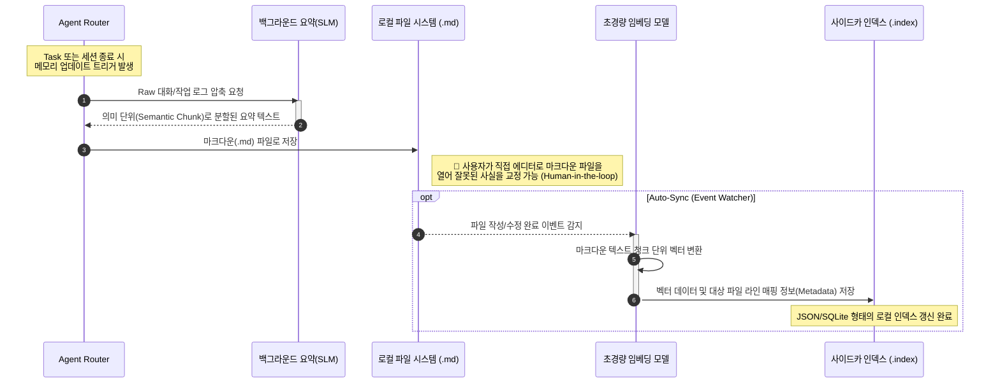
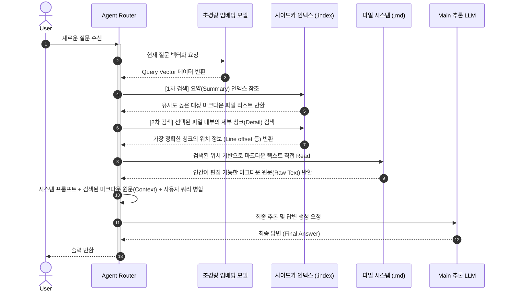

# 메모리 임베딩 (Memory Embeddings)

## 개요

**메모리 임베딩(Memory Embeddings)**은 AI 에이전트의 기억 장치에서 마크다운(Markdown) 기반의 텍스트 저장소와 로컬 벡터 인덱싱(Local Vector Indexing)을 결합한 하이브리드 메모리 관리 기법입니다. 이 방식은 고가의 벡터 데이터베이스(Vector DB)를 별도로 운영하기 어려운 로컬 환경이나, 사람이 직접 내용을 확인하고 수정할 수 있는 투명성(Transparency)이 중요한 개인용 자율 에이전트 시스템(예: OpenClaw)에서 핵심적인 기술로 자리 잡았습니다.

---

## 1. 핵심 철학: "DB 없는 시맨틱 검색"

기존의 에이전트 메모리가 단순히 과거의 텍스트를 컨텍스트 윈도우에 밀어 넣거나, 복잡한 외부 벡터 DB에 의존했던 것과 달리, 메모리 임베딩은 **'마크다운 파일이 곧 데이터베이스'**가 되는 방식을 취합니다.

- **인간 중심의 데이터**: 메모리는 사람이 읽을 수 있는 `.md` 파일로 저장되어 누구나 직접 편집할 수 있습니다.
- **기계 중심의 검색**: 저장된 마크다운 파일의 각 섹션이나 요약을 경량 임베딩 모델(Local SLM)을 통해 벡터화하고, 이를 사이드카(Sidecar) 형태의 로컬 인덱스(JSON 또는 SQLite)로 관리하여 의미 기반의 초고속 검색을 가능하게 합니다.

---

## 2. 작동 메커니즘

메모리 임베딩 시스템은 크게 **생성(Generation), 인덱싱(Indexing), 검색(Retrieval)**의 3단계로 동작합니다.

### 2.1. 메모리 생성 및 요약 (Summarization)
에이전트가 수행한 작업 로그나 대화 내용을 그대로 저장하면 노이즈가 너무 많아 검색 효율이 떨어집니다. 따라서 백그라운드에서 실행되는 소형 모델(예: Llama-3-8B)이 방금 끝난 세션의 핵심 내용을 **'의미 단위(Semantic Chunk)'**로 요약하여 마크다운 파일로 기록합니다.

### 2.2. 로컬 벡터 인덱싱
요약된 마크다운 파일이 생성되거나 수정될 때마다, `BGE-micro`나 `GTE-tiny`와 같은 초경량 임베딩 모델이 해당 텍스트를 벡터로 변환합니다. 이 벡터 데이터는 별도의 DB 서버가 아닌, 프로젝트 폴더 내의 숨겨진 로컬 인덱스 파일에 저장됩니다.

### 2.3. 동적 컨텍스트 주입 (Retrieval)
사용자가 새로운 질문을 던지면, 에이전트는 질문의 임베딩을 계산하고 로컬 인덱스에서 가장 유사한 과거 메모리 조각(Snippet)들을 찾아냅니다. 이후 해당 마크다운 파일의 본문을 읽어와 현재 LLM의 프롬프트에 동적으로 삽입합니다.

### 2.4. 작동 로직 시퀀스 분석

이러한 메모리 임베딩 아키텍처는 고가의 호스팅 DB 없이도 파일 동기화와 계층적 검색을 통해 시스템의 일관성을 유지합니다. 시스템은 크게 **업데이트(인덱싱)** 흐름과 **호출(검색 단위)** 흐름으로 동작합니다.

#### 1) 메모리 업데이트 및 인덱싱 (Write & Index Flow)
작업 대화 기록을 요약하여 마크다운 파일로 저장하고, 파일 시스템 이벤트를 감지해 백그라운드에서 로컬 사이드카 인덱스를 갱신하는 시퀀스입니다.

#### 2) 메모리 검색 및 주입 (Retrieval & Call Flow)
새로운 쿼리가 들어왔을 때, 벡터 DB를 통해 파일의 '위치'만 찾은 뒤, 원본 텍스트를 마크다운에서 직접 가져와 환각(Hallucination)을 최소화하는 하이브리드 주입 시퀀스입니다.

---

## 3. OpenClaw의 구현 사례

자율형 에이전트 프로젝트인 [OpenClaw](../open_source_project/open_claw.md)는 이 기법을 통해 수천 개의 스킬 사용 이력과 수개월 치의 대화 로그를 관리합니다.

- **Memory Bank 구조**: `.claw/memory/` 디렉토리에 날짜별, 프로젝트별로 마크다운 파일을 자동 생성합니다.
- **사이드카 인덱스**: 마크다운 파일과 쌍을 이루는 `.index` 파일을 통해 벡터 데이터를 관리하며, 파일이 직접 수정되면 인덱스를 자동으로 갱신(Auto-sync)합니다.
- **계층적 검색**: 먼저 '요약 임베딩'을 검색하여 관련 파일을 찾고, 그 파일 내부에서 '상세 임베딩'을 검색하여 필요한 정보를 정확히 타격(Pinpoint)합니다.

---

## 4. 메모리 임베딩의 장점

1.  **낮은 비용과 프라이버시**: 외부 SaaS DB를 사용하지 않으므로 비용이 발생하지 않으며, 모든 데이터가 로컬 기기에만 머물러 보안이 강력합니다.
2.  **편집 가능성 (Human-in-the-loop)**: 에이전트가 잘못된 내용을 기억했다면, 사용자가 직접 마크다운 파일을 열어 텍스트를 수정하는 것만으로 기억을 교정할 수 있습니다.
3.  **이식성**: 특정 DB 벤더에 종속되지 않으며, 마크다운 파일과 인덱스 파일만 복사하면 다른 장치에서도 동일한 기억을 가진 에이전트를 구동할 수 있습니다.

---

## 연관 문서
- [에이전트 메모리 관리 (Memory)](./memory.md)
- [OpenClaw 프로젝트 안내](../open_source_project/open_claw.md)
- [RAG (검색 증강 생성) 개요](../RAG/index.md)
