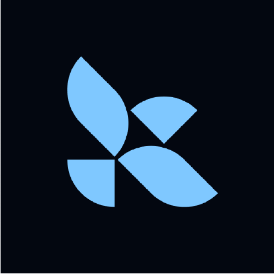

# LangGraph

LangGraph는 LangChain 생태계의 일부로, 에이전트와 다중 에이전트 시스템을 구축하기 위해 설계된 강력한 프레임워크입니다. 특히 '순환(Cycles)'이 포함된 복잡한 로직을 그래프 형태로 모델링하는 데 특화되어 있습니다.

## 1. 핵심 철학
- **상태 중심(Stateful)**: 전체 워크플로우를 관통하는 'State(상태)'를 명확히 정의하고 관리합니다.
- **순환(Cycles)**: 에이전트가 결과를 검토하고 다시 이전 단계로 돌아가는 'Loop'를 자연스럽게 구현합니다.
- **제어 가능성(Control)**: 블랙박스 형태의 에이전트보다는, 개발자가 각 노드와 엣지를 명시적으로 설계하여 높은 예측 가능성을 확보합니다.

## 2. 주요 기능
- **State Management**: 그래프 전체에서 공유되는 상태 객체를 통해 데이터를 전달합니다.
- **Persistence (Checkpointer)**: 에이전트의 현재 상태를 저장(Snapshot)하고, 오류가 발생하거나 사용자 승인이 필요할 때 나중에 다시 시작할 수 있게 합니다.
- **Human-in-the-loop**: 에이전트 실행 중에 특정 노드에서 멈춰 사용자의 승인이나 입력을 기다리는 로직을 쉽게 추가할 수 있습니다.
- **Multi-Agent Orchestration**: 여러 독립된 에이전트 그래프를 하나의 거대한 시스템으로 통합할 수 있습니다.

## 3. 구현 방식
LangGraph는 세 가지 주요 구성 요소를 통해 에이전트를 정의합니다.
1. **Nodes**: 실제 작업을 수행하는 파이썬 함수입니다.
2. **Edges**: 노드 간의 연결을 정의하며, 조건에 따라 분기(Conditional Edges)할 수 있습니다.
3. **State**: 노드 간에 전달되는 데이터 구조입니다.

## 4. 장단점
- **장점**: 극도로 복잡한 비즈니스 로직 구현이 가능하며, 디버깅과 트레이싱이 용이합니다.
- **단점**: LangChain 생태계에 대한 이해도가 필요하며, 단순한 작업을 구현할 때 학습 곡선이 높을 수 있습니다.
