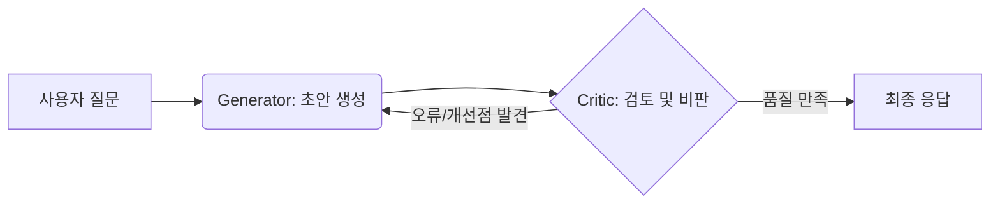
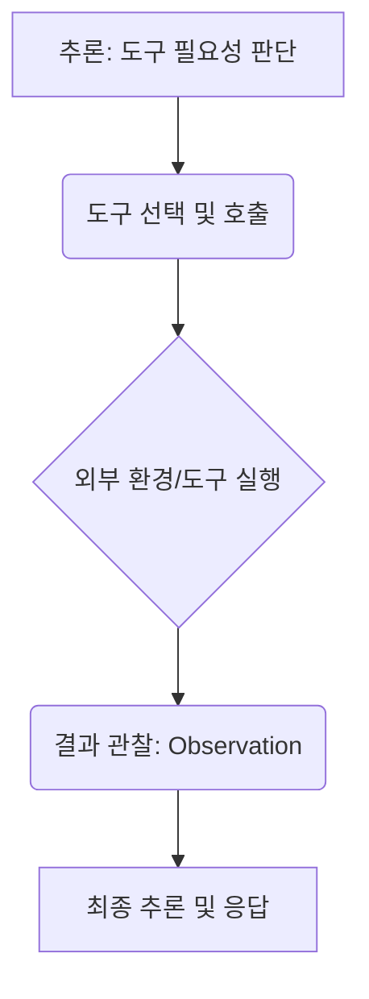
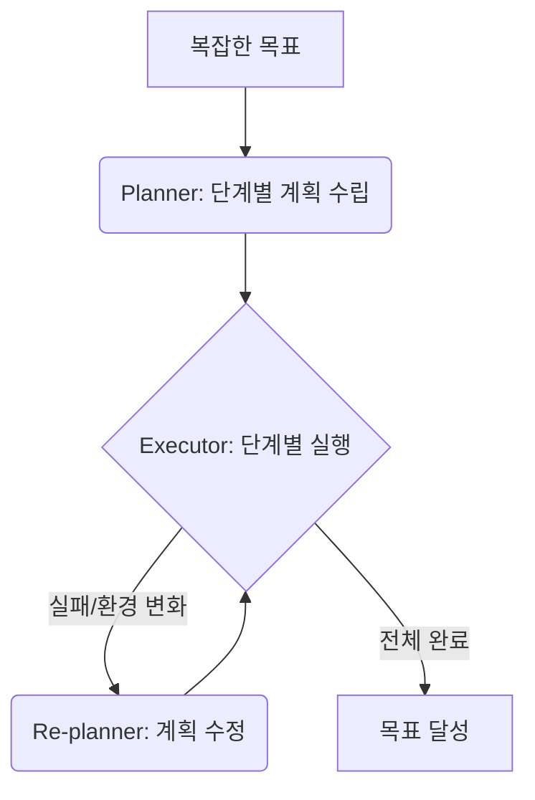
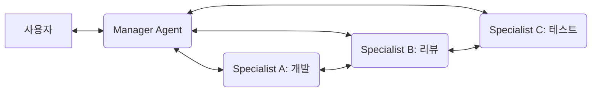

# 에이전틱 설계 패턴 (Patterns)

Andrew Ng 교수가 제시한 4가지 설계 패턴은 Agentic AI를 구현하는 가장 강력한 프레임워크입니다.

## 1. Reflection (반성)
생성된 결과물을 스스로 비판하고 개선하는 패턴입니다.

- **메커니즘**: 모델이 답변을 생성한 후, 다른 프롬프트(혹은 다른 모델)가 해당 답변의 오류를 찾고 개선안을 제시합니다.
- **효과**: 코드 버그 수정, 작문 품질 향상 등에서 매우 높은 정확도를 보여줍니다.

## 2. Tool Use (도구 사용)
에이전트가 자신의 한계를 인지하고 외부 도구(API, SQL, Web Search)를 활용하는 패턴입니다.

- **메커니즘**: 필요한 정보나 행동이 있을 때 적절한 도구를 선택하여 실행하고 그 결과를 문맥에 반영합니다.
- **효과**: 최신 정보 반영, 정확한 수치 계산, 시스템 자동화가 가능해집니다.

## 3. Planning (계획 수립)
복잡한 미션을 수행 가능한 작은 단계들로 분해하고 실행 순서를 결정하는 패턴입니다.

- **메커니즘**: 목표를 세분화(Decomposition)하고, 실행 도중 상황이 바뀌면 계획을 실시간으로 수정(Re-planning)합니다.
- **효과**: 모호하고 방대한 작업을 체계적으로 완료할 수 있습니다.

## 4. Multi-agent Collaboration (협업)
서로 다른 전문성을 가진 여러 에이전트가 협업하여 결과를 도출하는 패턴입니다.

- **메커니즘**: 개발자, 디자이너, QA 에이전트가 각자의 역할을 수행하며 서로 대화하고 협력합니다.
- **효과**: 단일 지능의 한계를 넘어 실제 조직과 유사한 복잡한 업무를 자동화할 수 있습니다.

---

### 패턴 적용 시의 핵심 질문
- **언제 Reflection을 쓸 것인가?**: 답변의 품질이 결정적일 때 (예: 코드 생성)
- **어떤 도구를 제공할 것인가?**: 에이전트의 권한과 보안을 고려한 최소 권한의 도구 제공
- **계획은 얼마나 세밀해야 하는가?**: 너무 세밀하면 유연성이 떨어지고, 너무 넓으면 실행력이 떨어짐
