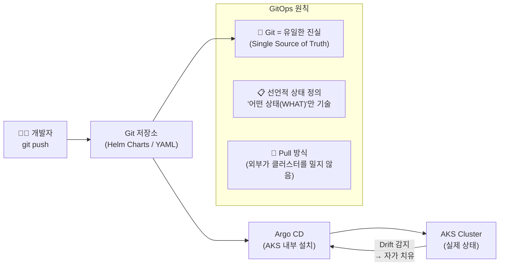
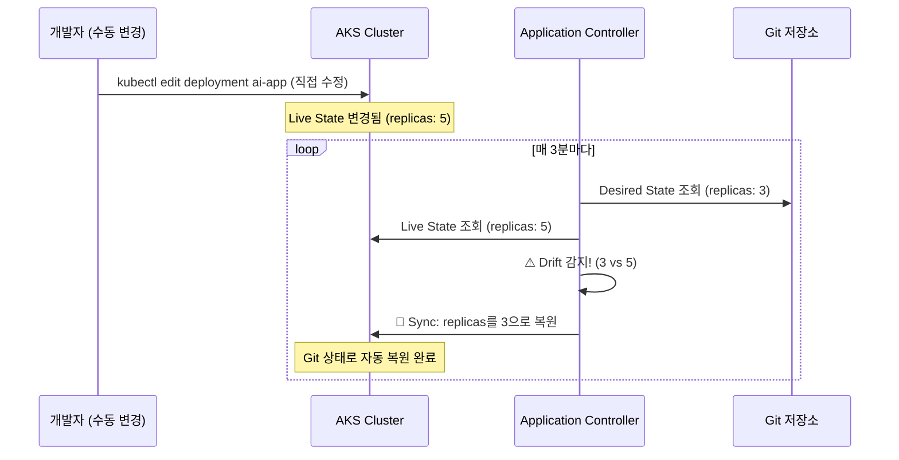
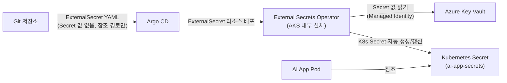

# Argo CD: GitOps 기반 지속적 배포 도구

## 개요

**Argo CD**는 Kubernetes 환경을 위한 **선언적(Declarative) GitOps 기반의 지속적 배포(Continuous Delivery, CD) 도구**입니다. CNCF(클라우드 네이티브 컴퓨팅 재단)에서 관리되는 오픈소스 프로젝트로, 애플리케이션의 설정과 배포 상태를 **Git 저장소에 정의**하고, 이 상태를 실제 Kubernetes 클러스터의 상태와 **자동으로 일치**시키는 역할을 합니다.

Azure 환경에서는 AKS 클러스터의 AI 애플리케이션 배포를 다음과 같이 분리하는 것이 모범 사례입니다.

- **CI (GitHub Actions)**: 이미지 빌드 → ACR 푸시 → Git 매니페스트 업데이트
- **CD (Argo CD)**: Git 변경 감지 → AKS 자동 동기화

---

## 1. 핵심 기반 개념: GitOps

**GitOps**는 DevOps 실천 방식 중 하나로, Git 저장소를 인프라와 애플리케이션 설정의 **단일 진실 공급원(Single Source of Truth, SSOT)** 으로 삼는 운영 철학입니다.



| 구분 | 기존 Push 방식 (Jenkins 등) | GitOps Pull 방식 (Argo CD) |
| :--- | :--- | :--- |
| **배포 방향** | 외부 CI 서버 → 클러스터 (Push) | 클러스터 내부 → Git (Pull) |
| **클러스터 인증 정보** | 외부 서버에 노출 필요 | 외부에 노출 불필요 |
| **배포 기록 관리** | CI 서버 로그 | Git 커밋 이력 |
| **롤백 방법** | 별도 롤백 스크립트 실행 | `git revert` 한 줄 |
| **Drift 자동 수정** | 없음 | ✅ Self-healing |

---

## 2. 아키텍처 및 작동 원리

Argo CD는 AKS 클러스터 내부에 파드(Pod) 형태로 설치되며, 3개의 핵심 컴포넌트로 구성됩니다.

```mermaid
graph TB
    subgraph "외부"
        Dev["👨‍💻 개발자"]
        GitHub["Git 저장소\n(Helm Charts)"]
        ACR["Azure Container Registry"]
        GHCI["GitHub Actions\n(CI 파이프라인)"]
    end

    subgraph "AKS Cluster 내부"
        subgraph "Argo CD 컴포넌트"
            API["API Server\n(Web UI / CLI / REST)"]
            Repo["Repository Server\n(Git 접근 및 캐싱\nHelm/Kustomize 렌더링)"]
            AC["Application Controller\n⭐ 핵심 뇌\n(Desired vs Live 상태 비교\n및 Sync 수행)"]
        end

        subgraph "배포 대상 네임스페이스"
            App1["AI App Pod"]
            App2["LiteLLM Pod"]
        end
    end

    Dev -->|YAML 수정 커밋| GitHub
    GHCI -->|이미지 태그 업데이트 커밋| GitHub
    ACR -->|이미지 제공| AKS

    API <-->|사용자 조작| Dev
    Repo -->|Pull (주기적 폴링)| GitHub
    AC -->|렌더링 요청| Repo
    AC -->|"상태 불일치 발견 → Sync"| App1
    AC -->|"상태 불일치 발견 → Sync"| App2
```

### 컴포넌트별 역할

| 컴포넌트 | 역할 |
| :--- | :--- |
| **API Server** | Web UI, CLI(`argocd` 명령어), CI 시스템과의 REST/gRPC 통신 담당 |
| **Repository Server** | Git 저장소 접근·캐싱. Helm Chart나 Kustomize를 순수 YAML로 렌더링 |
| **Application Controller** | Git의 **기대 상태(Desired State)** vs 클러스터의 **현재 상태(Live State)** 를 지속 비교·동기화 |

---

## 3. AKS에 Argo CD 설치 및 기본 설정

```bash
# 네임스페이스 생성 및 Argo CD 설치
kubectl create namespace argocd
kubectl apply -n argocd -f \
  https://raw.githubusercontent.com/argoproj/argo-cd/stable/manifests/install.yaml

# 설치 완료 확인
kubectl get pods -n argocd

# Web UI 접근을 위한 포트 포워딩 (로컬 개발 시)
kubectl port-forward svc/argocd-server -n argocd 8080:443

# 초기 admin 비밀번호 확인
kubectl -n argocd get secret argocd-initial-admin-secret \
  -o jsonpath="{.data.password}" | base64 -d
```

> [!TIP]
> 프로덕션 환경에서는 포트 포워딩 대신 **Ingress + Application Gateway (AGIC)** 로 Web UI를 안전하게 노출합니다. 자세한 내용은 [네트워크 문서](../azure/networking.md)를 참고하세요.

---

## 4. Application 배포: Git 저장소 연결

Argo CD의 핵심 리소스는 **Application** 오브젝트입니다. "어떤 Git 저장소의 어떤 경로를, 어떤 클러스터의 어떤 네임스페이스에 배포할지"를 선언합니다.

```yaml
# argocd-app-ai-app.yaml
apiVersion: argoproj.io/v1alpha1
kind: Application
metadata:
  name: ai-app-production
  namespace: argocd
spec:
  project: default

  # 소스: Git 저장소의 Helm Chart 경로
  source:
    repoURL: https://github.com/my-org/helm-charts.git
    targetRevision: main         # 브랜치 또는 커밋 SHA
    path: charts/ai-app          # Helm Chart 위치
    helm:
      valueFiles:
        - values.prod.yaml       # 프로덕션 환경 설정 오버라이드

  # 배포 대상: AKS 클러스터 + 네임스페이스
  destination:
    server: https://kubernetes.default.svc   # 현재 클러스터
    namespace: production

  # 자동 동기화 정책
  syncPolicy:
    automated:
      prune: true        # Git에서 삭제된 리소스는 클러스터에서도 삭제
      selfHeal: true     # 수동 변경 감지 시 즉시 Git 상태로 복원 (자가 치유)
    syncOptions:
      - CreateNamespace=true    # 네임스페이스 자동 생성
      - ApplyOutOfSyncOnly=true # 변경된 리소스만 적용 (효율성)
```

```bash
# Application 등록
kubectl apply -f argocd-app-ai-app.yaml

# 또는 CLI로 직접 생성
argocd app create ai-app-production \
  --repo https://github.com/my-org/helm-charts.git \
  --path charts/ai-app \
  --dest-server https://kubernetes.default.svc \
  --dest-namespace production \
  --sync-policy automated \
  --auto-prune \
  --self-heal
```

---

## 5. 주요 기능 상세

### 자동 동기화 & Self-healing



### Web UI 시각화

Argo CD의 가장 큰 차별화 포인트입니다. **FluxCD** 대비 압도적인 강점으로, 다음 정보를 실시간 그래프로 제공합니다.

- 각 Kubernetes 리소스(Deployment, Service, Ingress, ConfigMap 등)의 상태 및 관계
- Git과의 동기화 상태 (`Synced` / `OutOfSync` / `Degraded`)
- 각 파드의 로그 직접 조회
- 배포 히스토리 및 롤백 버튼

---

## 6. 대규모 환경 운영 패턴

### App of Apps 패턴

수십 개의 마이크로서비스를 관리할 때 사용하는 패턴입니다. **하나의 Root Application이 여러 하위 Application의 YAML 디렉토리를 참조**하여, 새 서비스 추가 시 Git 디렉토리 생성만으로 전체 시스템에 자동 반영됩니다.

```
helm-charts/
└── apps/                        ← Root App이 이 경로를 참조
    ├── ai-app.yaml              ← ai-app Application 정의
    ├── litellm.yaml             ← litellm Application 정의
    ├── langfuse.yaml            ← langfuse Application 정의
    └── milvus.yaml              ← milvus Application 정의
```

```yaml
# root-app.yaml (모든 앱을 하나로 관리하는 루트)
apiVersion: argoproj.io/v1alpha1
kind: Application
metadata:
  name: root-app
  namespace: argocd
spec:
  source:
    repoURL: https://github.com/my-org/helm-charts.git
    path: apps           # 이 디렉토리 아래 모든 Application YAML을 자동 배포
    targetRevision: main
  destination:
    server: https://kubernetes.default.svc
    namespace: argocd
  syncPolicy:
    automated:
      prune: true
      selfHeal: true
```

### ApplicationSet: 멀티 클러스터 일괄 배포

단일 매니페스트로 **개발/스테이징/프로덕션 클러스터에 동시에** 애플리케이션을 배포합니다.

```yaml
# applicationset-ai-app.yaml
apiVersion: argoproj.io/v1alpha1
kind: ApplicationSet
metadata:
  name: ai-app-all-envs
  namespace: argocd
spec:
  generators:
    - list:
        elements:
          - cluster: dev
            url: https://dev-aks.eastus.k8s.local
            values_file: values.dev.yaml
          - cluster: staging
            url: https://staging-aks.eastus.k8s.local
            values_file: values.staging.yaml
          - cluster: production
            url: https://prod-aks.koreacentral.k8s.local
            values_file: values.prod.yaml

  template:
    metadata:
      name: 'ai-app-{{cluster}}'
    spec:
      source:
        repoURL: https://github.com/my-org/helm-charts.git
        path: charts/ai-app
        helm:
          valueFiles:
            - '{{values_file}}'
      destination:
        server: '{{url}}'
        namespace: production
      syncPolicy:
        automated:
          prune: true
          selfHeal: true
```

---

## 7. Secret 관리: External Secrets Operator

> [!WARNING]
> GitOps의 가장 큰 함정은 **API 키, DB 비밀번호 등을 Git에 평문으로 올리면 안 된다**는 점입니다. Argo CD와 함께 반드시 별도의 Secret 관리 전략을 사용해야 합니다.

Azure 환경에서는 **External Secrets Operator (ESO)** 를 사용해 **Azure Key Vault의 Secret을 자동으로 K8s Secret으로 동기화**하는 방식이 권장됩니다.



```yaml
# external-secret.yaml (Git에 올려도 안전한 파일 - 실제 값이 없음)
apiVersion: external-secrets.io/v1beta1
kind: ExternalSecret
metadata:
  name: ai-app-secrets
  namespace: production
spec:
  refreshInterval: 1h       # Key Vault에서 1시간마다 갱신
  secretStoreRef:
    name: azure-keyvault-store
    kind: ClusterSecretStore
  target:
    name: ai-app-env-secrets  # 생성할 K8s Secret 이름
  data:
    - secretKey: OPENAI_API_KEY
      remoteRef:
        key: openai-api-key    # Azure Key Vault의 Secret 이름
    - secretKey: DATABASE_URL
      remoteRef:
        key: db-connection-string
```

---

## 8. 장단점 요약

### 장점

| 장점 | 설명 |
| :--- | :--- |
| **즉각적인 롤백** | `git revert` 한 번으로 클러스터가 이전 정상 상태로 자동 복원 |
| **강화된 보안** | Pull 방식으로 클러스터 인증 정보를 외부에 노출하지 않음 |
| **강력한 Web UI** | FluxCD 대비 압도적인 시각화, kubectl 없이도 앱 상태 확인 가능 |
| **완전한 재해 복구** | 새 클러스터 + Argo CD 설치 + Git 연결만으로 100% 복구 |
| **Configuration Drift 방지** | 수동 변경을 감지하여 Git 상태로 자동 복원 |

### 단점 및 고려사항

| 단점 | 해결책 |
| :--- | :--- |
| **Secret 관리 복잡성** | External Secrets Operator + Azure Key Vault 연동 |
| **CI와의 연결 고리 필요** | GitHub Actions에서 이미지 태그를 Git에 자동 커밋하는 스크립트 추가 |
| **초기 설정 러닝 커브** | Helm Chart 구조화, App of Apps 패턴 이해 필요 |

---

## 9. 핵심 CLI 명령어 요약

```bash
# Argo CD CLI 로그인
argocd login <ARGOCD_SERVER> --username admin --password <PASSWORD>

# 전체 Application 목록 조회
argocd app list

# 특정 앱 상태 상세 확인
argocd app get ai-app-production

# 수동 동기화 실행
argocd app sync ai-app-production

# 이전 버전으로 롤백
argocd app rollback ai-app-production <REVISION_NUMBER>

# 앱 삭제 (cascade: 관련 K8s 리소스 모두 삭제)
argocd app delete ai-app-production --cascade

# Git 저장소 등록 (HTTPS)
argocd repo add https://github.com/my-org/helm-charts.git \
  --username my-user \
  --password <PAT>

# 외부 AKS 클러스터 등록
argocd cluster add <CONTEXT_NAME>
```

---

## 관련 문서

- **[AKS 설계 및 운영](../azure/aks.md)**: Argo CD가 배포를 수행하는 AKS 클러스터 구성
- **[ACR + CI/CD 파이프라인](../azure/acr-cicd.md)**: Argo CD의 CD와 연결되는 GitHub Actions CI 단계
- **[보안 & 인증 (Key Vault)](../azure/security-identity.md)**: External Secrets Operator와 연동되는 Azure Key Vault
- **[AX Infra 배포 전략](./deployment.md)**: 클라우드 공급자 무관 Kubernetes 배포 일반론
