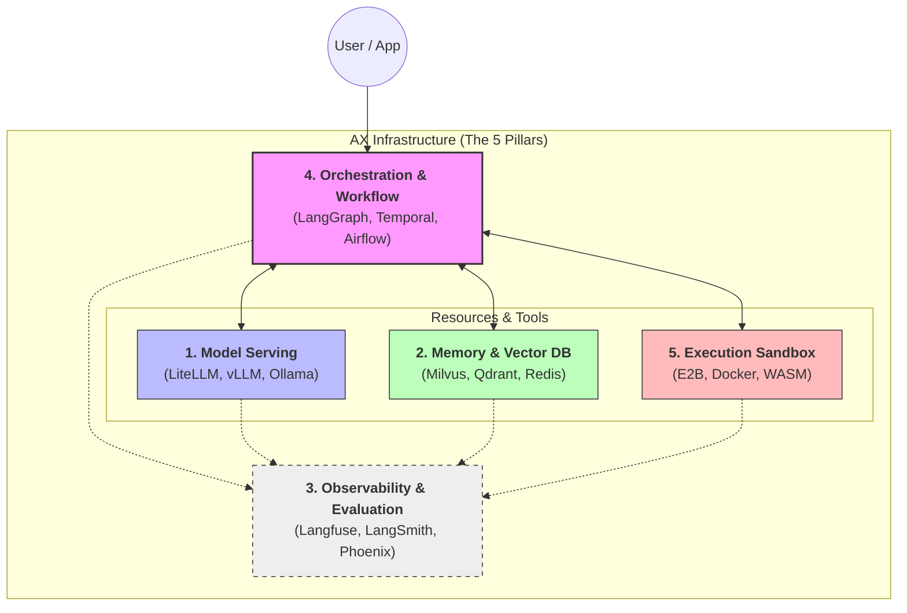

# AI Transformation 인프라 (AX Infra)

## 개요

**AX Infra(AI Transformation Infrastructure)**는 단순한 단일 LLM API 호출을 넘어, 기업 환경에서 신뢰성 있게 동작하는 **에이전트(Agent)** 기반의 시스템 규모를 지원하기 위한 필수적인 기술 토대입니다. 

PoC(Proof of Concept) 단계에서 주로 겪는 확장성, 관측 부재, 상태 관리의 어려움(참고: [PoC와 Production 사이의 간극](../ax/poc-to-prod-chasm.md))을 극복하고 **에이전틱 엔터프라이즈(Agentic Enterprise)**로 나아가기 위해서는 기존 웹/앱 아키텍처와는 구별되는 새로운 인프라 생태계가 필요합니다.

---

## AX 인프라 아키텍처 (AX Infra Architecture)

---

## 핵심 인프라 영역 (The 5 Pillars)

현재 에이전틱 AI 아키텍처에서 시스템을 프로덕션(Production) 레벨로 올리기 위해 필수적으로 고려되는 5대 인프라 영역은 다음과 같습니다.

### 1. [모델 서빙 및 API 게이트웨이](./model-serving-gateway.md)
LLM 자원을 효율적으로 할당하고, 수많은 AI 모델(OpenAI, Anthropic, 로컬 모델 등)에 대한 일관된 라우팅과 로드 밸런싱을 제공합니다.
- **주요 스택**: LiteLLM, vLLM, Ollama

### 2. [메모리 및 통합 데이터 저장소](./memory-data-infra.md)
에이전트가 과거의 대화 맥락(Context)을 기억하고, 파일 시스템을 활용해 상태를 보존하며, 기존 관계형 DB(RDBMS)나 지식 베이스에서 필요한 팩트를 인출할 수 있도록 돕는 저장소 생태계입니다.
- **주요 스택**: Milvus, Qdrant, Chroma, Redis, PostgreSQL (NL2SQL 연동)
- **연관 기술**: [Agent Memory](../agent/memory.md), [RAG](../RAG/index.md)

### 3. [관측 가능성 및 평가 (Observability & LLMOps)](./observability.md)
블랙박스처럼 동작하는 에이전트의 사고 과정(추론, 검색, 도구 사용 등)을 시각화하고, 비용(토큰)과 답변 품질을 추적합니다.
- **주요 스택**: Langfuse, LangSmith, Arize Phoenix
- **연관 기술**: [LLMOps/Langfuse](../llmops/langfuse.md)

### 4. [오케스트레이션 및 워크플로우 (Orchestration)](./orchestration-workflow.md)
멀티 에이전트의 복잡한 비동기 작업 흐름을 제어하고, 장애 발생 시 롤백 및 상태 복구(Durable Execution)를 보장합니다.
- **주요 스택**: Temporal, Apache Airflow, LangGraph

### 5. [실행 샌드박스 (Execution Sandbox)](./execution-sandbox.md)
에이전트가 코드를 작성하여 실행하거나, 시스템 장애를 유발할 수 있는 외부 도구를 호출할 때 격리된 안전한 환경(Security Boundary)을 제공합니다.
- **주요 스택**: E2B, Docker, WebAssembly

---

## 인프라 통합 환경 구축

앞서 설명한 5대 핵심 인프라 영역들을 프로덕션 레벨에서 단일 시스템으로 묶어서 띄우고 오토스케일링(Auto-scaling)하는 방안은 아래 문서를 참고하십시오.

- **[인프라 배포 및 운영 전략 (Kubernetes & Docker)](./deployment.md)**
