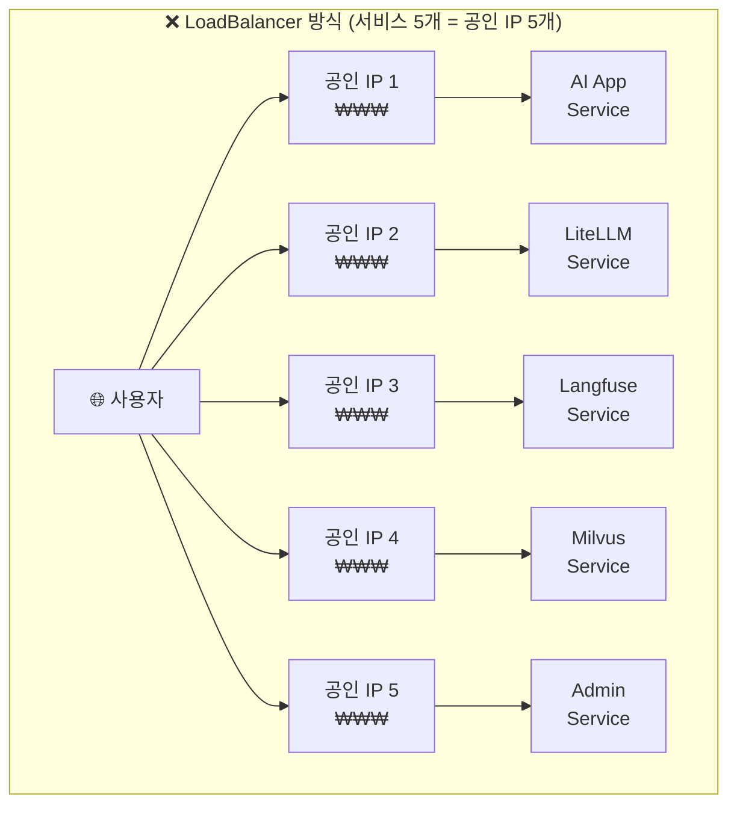
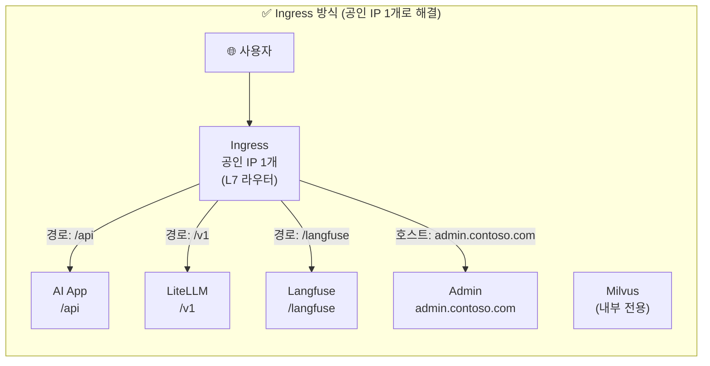
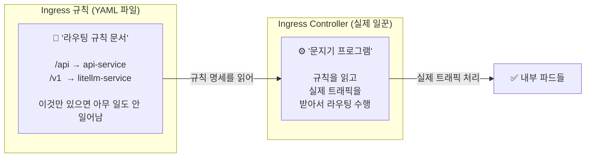
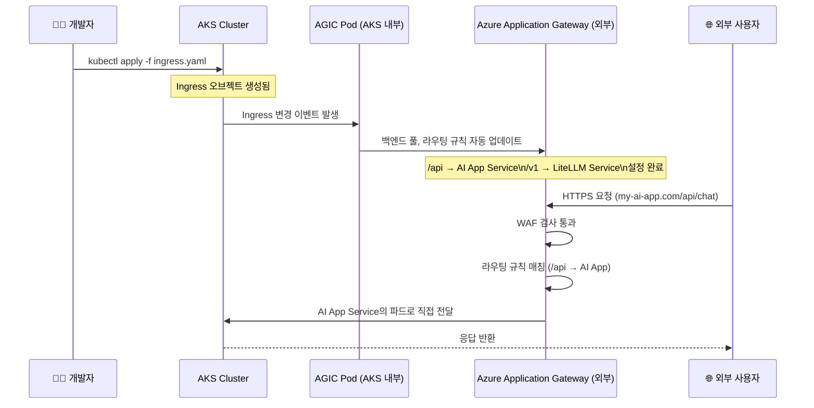
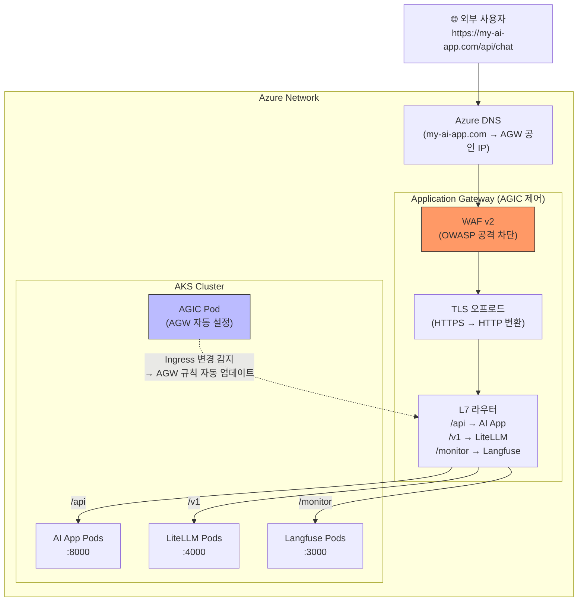

# Kubernetes Ingress & Azure AGIC

## 개요

파드(Pod)와 서비스(Service)를 이해했다면, 이제 외부 사용자가 이 서비스들에 어떻게 접속하는지를 제어하는 **Ingress(인그레스)** 를 이해해야 합니다. 특히 Azure 환경에서는 Application Gateway가 Ingress Controller 역할을 담당하는 **AGIC** 패턴이 핵심입니다.

---

## 1. Ingress가 왜 필요한가?

### LoadBalancer 방식의 한계

쿠버네티스 내부 서비스를 외부에 노출하는 가장 단순한 방법은 `LoadBalancer` 타입의 서비스를 만드는 것입니다. 그런데 마이크로서비스가 여러 개라면 심각한 문제가 생깁니다.





**Ingress 도입의 핵심 이점**:
- 공인 IP 1개 → 비용 절감
- TLS 인증서 1곳 관리 → 운영 단순화
- URL 규칙 하나로 전체 트래픽 제어

---

## 2. L7 라우팅: Ingress의 두 가지 핵심 방식

Ingress는 HTTP 패킷의 **Host 헤더**와 **URL 경로**를 분석해 트래픽을 분기합니다. OSI 7계층(어플리케이션 계층)에서 동작하므로 'L7 라우터'라고 부릅니다.

### A. 경로 기반 라우팅 (Path-based Routing)

하나의 도메인 아래 **URL 경로**에 따라 서로 다른 서비스로 분기합니다.

```
https://my-ai-app.com/api     → AI App Service (FastAPI)
https://my-ai-app.com/v1      → LiteLLM Proxy Service
https://my-ai-app.com/monitor → Langfuse Service
```

### B. Host 기반 라우팅 (Host-based / Virtual Hosting)

**도메인 자체**가 다를 때 서로 다른 서비스로 분기합니다.

```
https://api.my-ai-app.com   → AI App Service
https://admin.my-ai-app.com → Admin Dashboard Service
```

---

## 3. Ingress 규칙 vs Ingress Controller

> [!IMPORTANT]
> 이 둘을 혼동하면 Ingress가 왜 작동하지 않는지 이해할 수 없습니다. 반드시 한 세트로 이해하세요.



| 구분 | Ingress (규칙) | Ingress Controller (실행) |
| :--- | :--- | :--- |
| **형태** | Kubernetes YAML 오브젝트 | 클러스터에 실행 중인 파드/외부 서비스 |
| **역할** | "어떻게 라우팅할지" 선언 | 규칙을 읽고 실제 트래픽 처리 |
| **기본 제공** | ✅ (kubectl apply로 자유롭게 생성) | ❌ (직접 설치 필요) |
| **구현체 예시** | (공통 스펙) | NGINX, Traefik, HAProxy, **AGIC** |

---

## 4. Ingress YAML 구조 완전 분석

```yaml
# ai-app-ingress.yaml
apiVersion: networking.k8s.io/v1
kind: Ingress
metadata:
  name: ai-app-ingress
  namespace: production
  annotations:
    # ① 어떤 Ingress Controller를 사용할지 지정
    kubernetes.io/ingress.class: azure/application-gateway
    # ② HTTPS 강제 리다이렉트
    appgw.ingress.kubernetes.io/ssl-redirect: "true"
    # ③ WAF 정책 연결 (Azure 전용)
    appgw.ingress.kubernetes.io/waf-policy-for-path: >
      /subscriptions/.../wafPolicies/my-waf-policy

spec:
  # TLS 인증서 설정 (HTTPS)
  tls:
    - hosts:
        - my-ai-app.com
      secretName: tls-secret    # cert-manager로 자동 발급 가능

  # 라우팅 규칙 (Rules)
  rules:
    # ── Host 기반 라우팅 ──────────────────────────
    - host: my-ai-app.com       # 이 도메인으로 온 요청에 대해
      http:
        paths:
          # ── 경로 기반 라우팅 ────────────────────
          - path: /api
            pathType: Prefix    # /api, /api/chat, /api/v2 모두 매칭
            backend:
              service:
                name: ai-app-service
                port:
                  number: 8000

          - path: /v1
            pathType: Prefix    # /v1/chat/completions 등 매칭
            backend:
              service:
                name: litellm-service
                port:
                  number: 4000

          - path: /monitor
            pathType: Prefix
            backend:
              service:
                name: langfuse-service
                port:
                  number: 3000

    # ── 다른 도메인은 별도 라우팅 ─────────────────
    - host: admin.my-ai-app.com
      http:
        paths:
          - path: /
            pathType: Prefix
            backend:
              service:
                name: admin-service
                port:
                  number: 8080
```

---

## 5. Azure에서의 연결: AGIC 완전 이해

### 왜 NGINX Controller 대신 AGIC를 쓰는가?

| 비교 항목 | NGINX Ingress Controller | AGIC (Application Gateway) |
| :--- | :--- | :--- |
| **실행 위치** | AKS 내부 파드 | Azure 관리형 L7 LB (외부) |
| **WAF** | 별도 설치·관리 필요 | Azure WAF 기본 통합 |
| **TLS 오프로드** | 파드에서 처리 | Application Gateway에서 처리 |
| **스케일링** | K8s HPA로 파드 스케일링 | Azure가 자동 관리 |
| **비용** | 파드 리소스 비용 | Application Gateway 시간 요금 |
| **Azure 통합** | 별도 설정 필요 | Azure Monitor, Key Vault 네이티브 통합 |

### AGIC 작동 원리



**핵심 포인트**: 개발자는 **Ingress YAML만 관리**하면 됩니다. AGIC가 자동으로 Application Gateway의 복잡한 설정(백엔드 풀, HTTP 설정, 라우팅 규칙)을 생성·수정합니다.

---

## 6. 트래픽 라우팅 시뮬레이션

아래 표는 실제 요청 URL이 어떤 규칙과 매칭되어 어느 서비스로 전달되는지 보여줍니다.

| 요청 URL | Host 매칭 | Path 매칭 | 전달 대상 | 비고 |
| :--- | :--- | :--- | :--- | :--- |
| `https://my-ai-app.com/api/chat` | ✅ `my-ai-app.com` | ✅ `/api` (Prefix) | **AI App Service** :8000 | |
| `https://my-ai-app.com/v1/completions` | ✅ `my-ai-app.com` | ✅ `/v1` (Prefix) | **LiteLLM Service** :4000 | |
| `https://my-ai-app.com/monitor/traces` | ✅ `my-ai-app.com` | ✅ `/monitor` (Prefix) | **Langfuse Service** :3000 | |
| `https://admin.my-ai-app.com/dashboard` | ✅ `admin.my-ai-app.com` | ✅ `/` (Prefix) | **Admin Service** :8080 | Host 기반 |
| `https://my-ai-app.com/unknown` | ✅ `my-ai-app.com` | ❌ 매칭 없음 | **404 Default Backend** | |
| `http://my-ai-app.com/api` | ✅ | ✅ | **HTTPS 리다이렉트** | ssl-redirect annotation |

---

## 7. cert-manager: TLS 인증서 자동 발급

Ingress의 TLS를 수동으로 관리하는 것은 인증서 만료 위험이 있습니다. **cert-manager**를 사용하면 Let's Encrypt(무료) 또는 Azure Key Vault 인증서를 **자동 발급·갱신**합니다.

```bash
# cert-manager 설치 (Helm)
helm repo add jetstack https://charts.jetstack.io
helm install cert-manager jetstack/cert-manager \
  --namespace cert-manager \
  --create-namespace \
  --set installCRDs=true
```

```yaml
# cluster-issuer.yaml (Let's Encrypt 발급자 등록)
apiVersion: cert-manager.io/v1
kind: ClusterIssuer
metadata:
  name: letsencrypt-prod
spec:
  acme:
    server: https://acme-v02.api.letsencrypt.org/directory
    email: admin@my-ai-app.com
    privateKeySecretRef:
      name: letsencrypt-prod
    solvers:
      - http01:
          ingress:
            class: azure/application-gateway
```

```yaml
# Ingress에서 cert-manager 자동 발급 사용
metadata:
  annotations:
    cert-manager.io/cluster-issuer: letsencrypt-prod  # ← 이 한 줄 추가
spec:
  tls:
    - hosts:
        - my-ai-app.com
      secretName: my-ai-app-tls   # cert-manager가 자동으로 이 Secret 생성·갱신
```

---

## 8. Ingress + AGIC 전체 흐름 정리



---

## 관련 문서

- **[네트워크: VNet, App Gateway, Ingress](../azure/networking.md)**: AGIC 설치 명령어 및 VNet 서브넷 설계 상세
- **[AKS 설계 및 운영](../azure/aks.md)**: Ingress로 들어온 트래픽을 받는 파드 관리
- **[Argo CD](./argocd.md)**: Ingress YAML을 GitOps로 자동 배포하는 방법
- **[보안 & 인증](../azure/security-identity.md)**: WAF와 연동되는 Azure Key Vault TLS 인증서 관리
