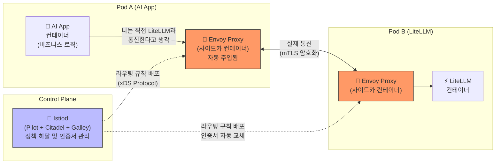
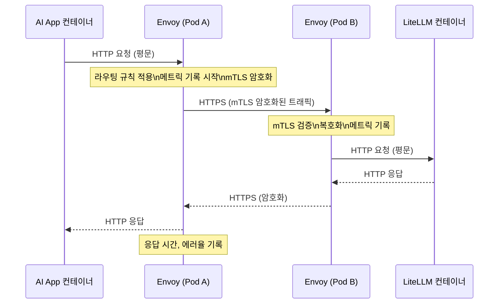
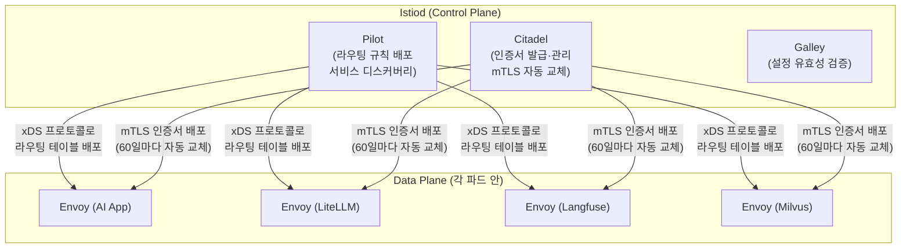
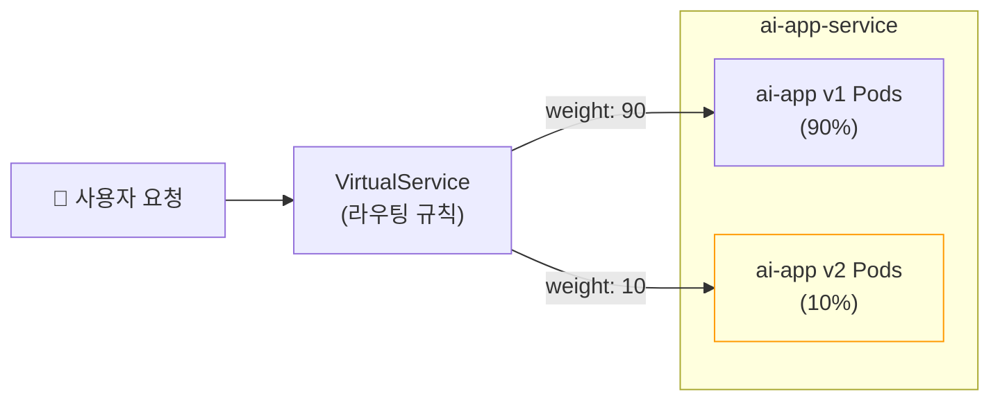
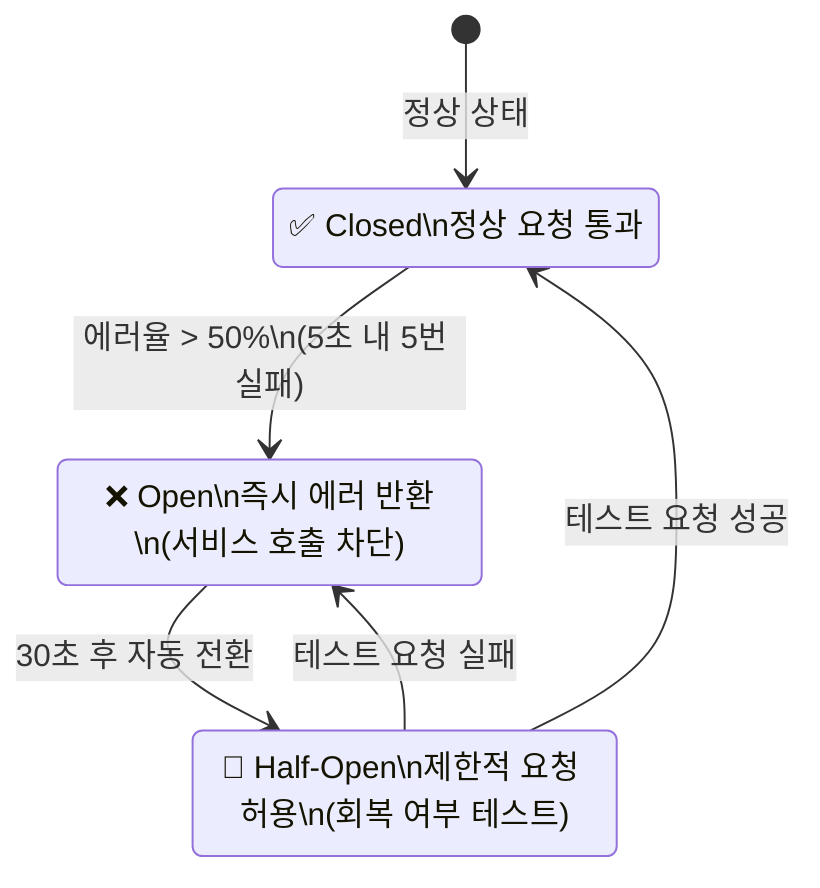
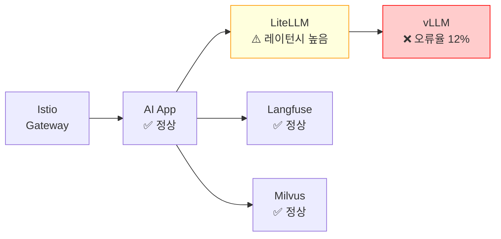
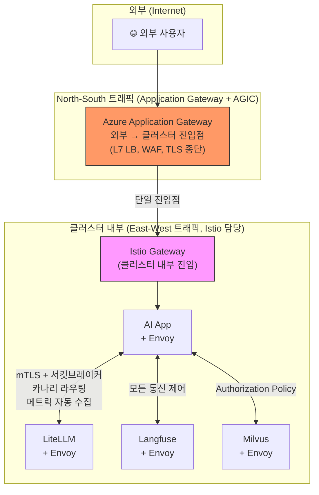

# Istio: 서비스 메시(Service Mesh)

## 개요

Argo CD로 배포하고, Ingress로 외부 트래픽을 받는 구조를 갖췄다면, 이제 클러스터 **내부** 마이크로서비스들 간의 통신을 제어할 차례입니다. **Istio**는 바로 이 **동서(East-West) 내부 트래픽**을 관리하는 **서비스 메시(Service Mesh)** 솔루션입니다.

> **비유:** Kubernetes가 도시의 '도로와 건물'을 만들어준다면, Istio는 그 도로 위의 **'스마트 신호등, 경찰관, 그리고 곳곳의 CCTV'**입니다.

---

## 1. 왜 쿠버네티스 기본 기능만으로는 부족한가?

서비스가 50개, 100개로 늘어나는 AI 마이크로서비스 환경에서 K8s 기본 `Service` 객체만으로는 다음 한계에 부딪힙니다.

| 문제 | K8s 기본 기능 | Istio 해결책 |
| :--- | :--- | :--- |
| **정밀 트래픽 분배** | 단순 Round-Robin만 가능 (1:1, 5:5) | 비중(%) 기반 카나리 배포, Header 기반 라우팅 |
| **장애 전파 방지** | 다운 서비스 호출 시 타임아웃까지 계속 대기 | 서킷 브레이커로 즉시 차단 (Fail-fast) |
| **내부 통신 가시성** | 파드 간 통신 추적 불가 | 모든 트래픽 자동 메트릭·분산 추적 수집 |
| **내부 보안** | 파드 간 통신 평문(HTTP) 기본값 | mTLS로 전체 암호화 자동 적용 |

**핵심**: Istio는 **애플리케이션 코드를 단 한 줄도 수정하지 않고** 이 모든 인프라 레벨 문제를 해결합니다.

---

## 2. 핵심 아키텍처: 사이드카(Sidecar) 패턴

### Envoy Proxy: 모든 마법의 출발점

Istio가 코드 수정 없이 동작할 수 있는 이유는 **사이드카 패턴**과 **Envoy 프록시**입니다.



### 사이드카 자동 주입

특정 네임스페이스에 라벨을 붙이면, 이후 해당 네임스페이스에 생성되는 **모든 파드에 Envoy 사이드카가 자동으로 주입**됩니다.

```bash
# 네임스페이스에 사이드카 자동 주입 활성화
kubectl label namespace production istio-injection=enabled

# 주입 확인 (컨테이너가 2개 = 앱 + Envoy)
kubectl get pods -n production
# NAME                    READY   STATUS    RESTARTS
# ai-app-xxx              2/2     Running   0   ← READY 2/2 이면 사이드카 주입 성공
```

### 통신 흐름



---

## 3. Control Plane: Istiod

**Istiod**는 클러스터 내 모든 Envoy 프록시를 중앙에서 제어하는 두뇌입니다.



---

## 4. 트래픽 관리: VirtualService & DestinationRule

Istio의 트래픽 제어는 두 개의 CRD(Custom Resource Definition)로 이루어집니다.

- **VirtualService**: "어디서 오는 트래픽을 어디로 보낼지" 라우팅 규칙 정의
- **DestinationRule**: "목적지 서비스의 어떤 버전(subset)으로 보낼지" 정의

### 카나리 배포 (Canary Deployment)

새 버전(v2)에 트래픽의 10%만 보내 안정성을 검증한 후 점진적으로 확대합니다.



```yaml
# destination-rule.yaml: v1, v2 버전 정의
apiVersion: networking.istio.io/v1alpha3
kind: DestinationRule
metadata:
  name: ai-app-dr
  namespace: production
spec:
  host: ai-app-service  # K8s Service 이름
  subsets:
    - name: v1
      labels:
        version: "v1"   # Pod의 라벨과 매핑
    - name: v2
      labels:
        version: "v2"
---
# virtual-service.yaml: 트래픽 분배 규칙
apiVersion: networking.istio.io/v1alpha3
kind: VirtualService
metadata:
  name: ai-app-vs
  namespace: production
spec:
  hosts:
    - ai-app-service
  http:
    - route:
        - destination:
            host: ai-app-service
            subset: v1
          weight: 90   # 90% → v1
        - destination:
            host: ai-app-service
            subset: v2
          weight: 10   # 10% → v2 (카나리)
```

### Header 기반 라우팅: 특정 사용자만 새 버전으로

```yaml
# 'x-canary: true' 헤더가 있는 요청만 v2로 전송
# (QA팀이나 내부 직원만 새 버전 테스트에 활용)
spec:
  http:
    - match:
        - headers:
            x-canary:
              exact: "true"
      route:
        - destination:
            host: ai-app-service
            subset: v2
    - route:         # 나머지는 모두 v1
        - destination:
            host: ai-app-service
            subset: v1
```

### 서킷 브레이커 (Circuit Breaker)

장애 서비스 호출 시 즉시 차단하여 장애 전파를 막습니다.



```yaml
# destination-rule.yaml에 서킷 브레이커 추가
spec:
  host: litellm-service
  trafficPolicy:
    outlierDetection:
      consecutive5xxErrors: 5    # 5번 연속 5xx 에러 시
      interval: 10s              # 10초 단위로 체크
      baseEjectionTime: 30s      # 30초 동안 해당 파드 제외
      maxEjectionPercent: 50     # 전체 파드의 최대 50%까지만 제외
```

---

## 5. 보안: mTLS (상호 TLS)

**mTLS(Mutual TLS)** 는 서버뿐 아니라 **클라이언트도 인증서로 자신을 증명**하는 양방향 TLS입니다. Istio는 Citadel이 자동으로 각 파드에 인증서를 발급하고 교체하므로, 개발자 개입 없이 클러스터 전체가 Zero-Trust 보안을 달성합니다.

```yaml
# peer-authentication.yaml: 네임스페이스 전체에 mTLS 강제 적용
apiVersion: security.istio.io/v1beta1
kind: PeerAuthentication
metadata:
  name: default
  namespace: production
spec:
  mtls:
    mode: STRICT   # STRICT: mTLS가 아닌 평문 트래픽 완전 차단
                   # PERMISSIVE: mTLS와 평문 모두 허용 (마이그레이션 단계)
```

```yaml
# authorization-policy.yaml: 서비스 간 접근 제어
# "AI App만 LiteLLM을 호출할 수 있다" 규칙
apiVersion: security.istio.io/v1beta1
kind: AuthorizationPolicy
metadata:
  name: litellm-policy
  namespace: production
spec:
  selector:
    matchLabels:
      app: litellm
  action: ALLOW
  rules:
    - from:
        - source:
            principals:
              - "cluster.local/ns/production/sa/ai-app-sa"  # AI App ServiceAccount만 허용
```

---

## 6. 가시성: Kiali & Jaeger

모든 트래픽이 Envoy를 통과하므로, 자동으로 수집된 데이터를 시각화 도구로 확인합니다.

### Kiali: 서비스 토폴로지 대시보드



Kiali는 이와 같은 **실시간 서비스 의존성 그래프**와 각 연결의 RPS(초당 요청수), 에러율, P99 레이턴시를 함께 보여줍니다.

### Jaeger: 분산 추적 (Distributed Tracing)

```
요청 ID: abc-123 (총 소요 시간: 2.3초)
├── AI App (0ms ~ 50ms): 50ms
├── Milvus 벡터 검색 (50ms ~ 350ms): 300ms
├── LiteLLM → vLLM (350ms ~ 2200ms): 1850ms  ← ⚠️ 병목!
└── Langfuse 기록 (2200ms ~ 2300ms): 100ms
```

---

## 7. Ingress vs Istio: 역할 구분



| 구분 | Application Gateway (Ingress) | Istio (Service Mesh) |
| :--- | :--- | :--- |
| **담당 영역** | North-South (외부 → 클러스터) | East-West (클러스터 내부) |
| **주요 기능** | L7 LB, WAF, TLS 종단, 도메인 라우팅 | 카나리 배포, 서킷 브레이커, mTLS, 분산 추적 |
| **위치** | Azure 관리형 서비스 (클러스터 외부) | 사이드카 프록시 (클러스터 내부 각 파드) |
| **설정 방식** | Kubernetes Ingress YAML + AGIC | VirtualService, DestinationRule, PeerAuthentication |

---

## 8. AKS에 Istio 설치

### 방법 A: AKS 관리형 Istio Add-on (권장)

```bash
# AKS Istio Add-on 활성화 (Azure가 버전 관리·업그레이드 담당)
az aks update \
  --resource-group my-rg \
  --name my-aks \
  --enable-azure-service-mesh

# 설치 확인
kubectl get pods -n aks-istio-system
```

### 방법 B: Helm으로 직접 설치

```bash
# Istio CLI 설치
curl -L https://istio.io/downloadIstio | sh -
export PATH=$PATH:./istio-*/bin

# 프로덕션 프로파일로 설치
istioctl install --set profile=default -y

# Kiali, Jaeger, Prometheus 애드온 설치
kubectl apply -f istio-*/samples/addons/
```

```bash
# 사이드카 자동 주입 대상 네임스페이스 지정
kubectl label namespace production istio-injection=enabled

# 기존 파드 재시작하여 사이드카 주입 적용
kubectl rollout restart deployment -n production
```

---

## 관련 문서

- **[Kubernetes Ingress & AGIC](./ingress.md)**: North-South 트래픽 담당. Istio와 함께 완전한 트래픽 제어 구성
- **[AKS 설계 및 운영](../azure/aks.md)**: Istio가 배포되는 AKS 클러스터 구성
- **[Argo CD](./argocd.md)**: Istio VirtualService YAML을 GitOps로 자동 배포 → 완전 자동 카나리 파이프라인
- **[모니터링 & 옵저버빌리티](../azure/observability.md)**: Istio 메트릭을 Azure Monitor로 수집하는 방법
