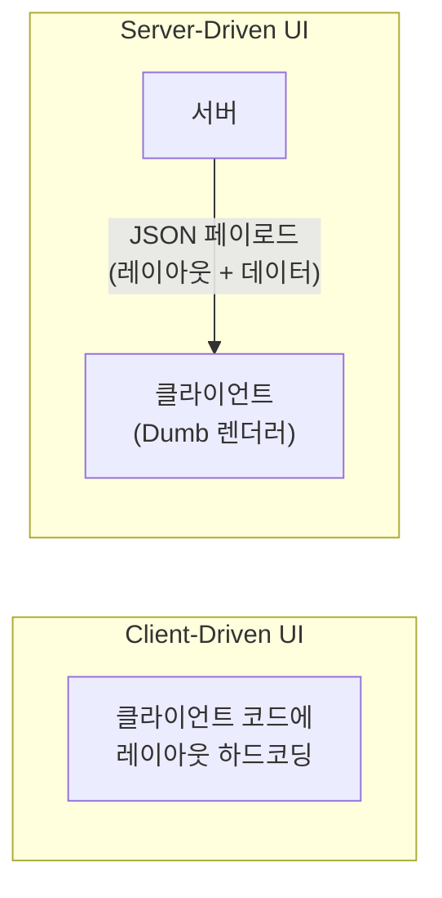
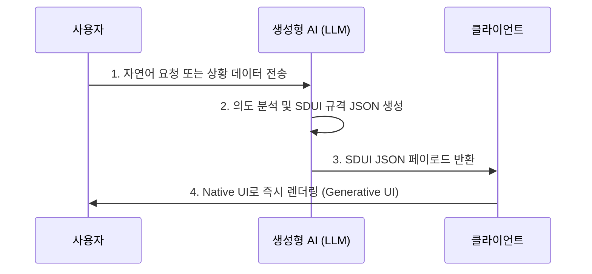
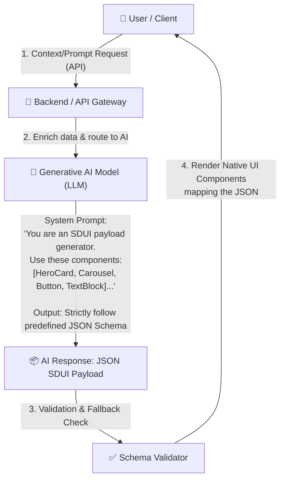
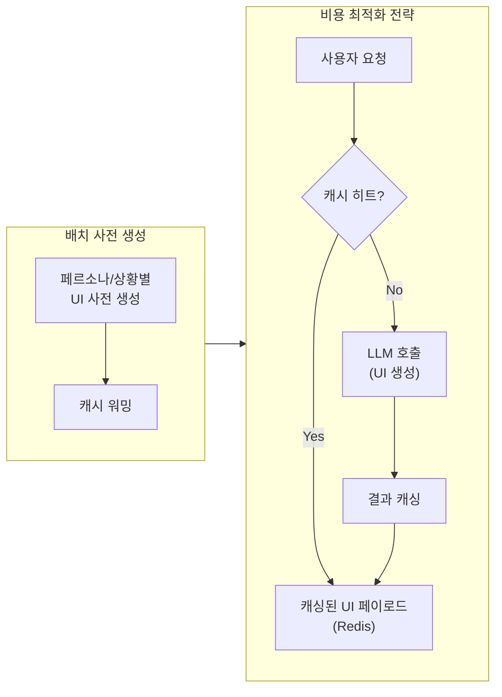

# SDUI와 생성형 AI의 융합을 통한 서비스 혁신

> **주제**: Server-Driven UI(SDUI)의 개념 및 생성형 AI를 활용한 차세대 동적 서비스 구축 방안
>
> **작성일**: 2026년 5월

---

## 1. Server-Driven UI (SDUI) 심층 분석

### 1.1 SDUI란 무엇인가?

전통적인 앱 개발 방식(Client-Driven UI)에서는 화면의 레이아웃, 컴포넌트의 종류, 비즈니스 로직 등이 클라이언트(iOS, Android, Web) 코드에 하드코딩됩니다. 반면, **SDUI(Server-Driven UI)**는 화면에 '무엇을(What)', '어떻게(How)' 그릴지를 클라이언트가 아닌 서버가 결정하여 JSON 등의 형태로 클라이언트에게 전달하는 아키텍처 패턴입니다.

클라이언트는 서버로부터 받은 응답 데이터를 해석하여, 미리 정의된 UI 컴포넌트(버튼, 텍스트, 이미지 카드 등)를 조립하고 화면에 렌더링하는 **'바보(Dumb) 렌더러'** 역할을 수행합니다.

### 1.2 SDUI의 핵심 장점

**앱 업데이트 없는 즉각적인 UI/UX 변경 (No App Store Approval)**
: 새로운 프로모션 배너 추가, 화면 레이아웃 변경, 컴포넌트 순서 변경 등을 앱 스토어 심사나 업데이트 없이 서버 배포만으로 즉시 반영할 수 있습니다.

**크로스 플랫폼 일관성 (Cross-Platform Consistency)**
: iOS, Android, Web이 동일한 서버 응답(JSON)을 바탕으로 화면을 구성하므로, 플랫폼 간 UI 및 비즈니스 로직의 파편화를 방지할 수 있습니다.

**개인화 및 A/B 테스트의 용이성**
: 서버가 사용자 데이터를 바탕으로 각 사용자마다 완전히 다른 레이아웃과 컴포넌트 구성을 내려줄 수 있어, 고도화된 개인화 및 A/B 테스트가 가능합니다.

### 1.3 SDUI의 한계점 (Trade-offs)

| 한계 | 설명 |
| :--- | :--- |
| **서버 복잡도 증가** | UI 레이아웃 로직이 서버로 이관되면서 서버의 부담과 복잡성이 크게 증가합니다. |
| **버전 파편화 관리** | 구버전 앱을 사용하는 유저의 클라이언트에는 새로 추가된 UI 컴포넌트가 없을 수 있습니다. 이를 위한 하위 호환성 및 버전 관리 로직이 필수적입니다. |
| **오프라인 지원의 어려움** | 화면을 그리기 위해 반드시 서버와 통신해야 하므로 네트워크가 없는 환경에서는 화면 구성이 제한됩니다. |

---

## 2. 생성형 AI와 SDUI의 융합 (Generative AI + SDUI)

전통적인 SDUI가 '인간(개발자/기획자)'이 미리 정의해 둔 규칙에 따라 서버가 UI를 내려주는 것이라면, 생성형 AI와 결합된 SDUI는 **AI가 실시간으로 사용자의 의도와 컨텍스트를 분석하여 맞춤형 UI를 동적으로 생성(Generate)하는 패러다임**을 의미합니다.

### 2.1 결합 원리: "AI가 JSON을 짜고, SDUI가 그린다"

LLM(대규모 언어 모델)은 **Function Calling**이나 **Structured Output(JSON Schema)** 기능을 통해 일관된 형태의 데이터를 반환하는 데 탁월해졌습니다.

### 2.2 생성형 AI + SDUI를 통한 서비스 개선 시나리오

#### A. 초개인화된 다이내믹 대시보드 (Hyper-Personalized Dashboard)

| 구분 | 내용 |
| :--- | :--- |
| **기존** | 사용자의 연령, 성별 등에 따라 정해진 3~4개의 템플릿 중 하나를 보여줌 |
| **AI+SDUI** | AI가 사용자의 최근 1시간 동안의 행동, 현재 위치, 기분(텍스트 입력 등)을 분석 |

> **예시 (금융 앱)**: 주식 시장이 폭락 중이고 사용자가 관련 뉴스를 많이 읽었다면, AI는 즉시 화면 상단에 '보유 종목 리스크 관리 카드'와 '안전 자산 이동 버튼'을 배치하는 SDUI 응답을 생성하여 보여줍니다. 사용자의 상황에 완벽히 동기화된 **일회성(Ephemeral) UI**가 생성됩니다.

#### B. 대화형 UI(Conversational UI)의 진화

| 구분 | 내용 |
| :--- | :--- |
| **기존** | 챗봇에게 "제주도 항공권 찾아줘"라고 하면 텍스트나 고정된 링크로만 답변 |
| **AI+SDUI** | LLM이 답변을 생성할 때 텍스트뿐만 아니라 **캘린더 컴포넌트, 항공권 검색 결과 카드, 가격 슬라이더** 등 상호작용 가능한 UI 컴포넌트 트리를 JSON으로 생성하여 채팅창 내에 임베딩 |

> Vercel의 AI SDK, ChatGPT의 Custom Actions UI와 유사한 경험을 제공합니다.

#### C. 제로 샷 온보딩 및 고객 지원 (Zero-Shot Onboarding)

| 구분 | 내용 |
| :--- | :--- |
| **기존** | 고정된 튜토리얼 화면 5장을 순서대로 넘겨야 함 |
| **AI+SDUI** | 사용자가 특정 기능에서 헤매고 있는 데이터를 감지하면, AI가 해당 사용자만을 위한 **'마이크로 튜토리얼 UI'**를 생성하여 화면에 표시. 사용자의 이해도에 따라 UI의 텍스트 난이도와 버튼의 크기까지 AI가 결정 |

#### D. 무한 A/B 테스트 및 자율 최적화 (Autonomous Conversion Optimization)

| 구분 | 내용 |
| :--- | :--- |
| **기존** | 기획자가 A안(빨간 버튼)과 B안(파란 버튼)을 기획하여 2주간 테스트 |
| **AI+SDUI** | AI 모델에 '구매 전환율 극대화'라는 목표를 주면, AI가 스스로 수천 가지의 컴포넌트 조합, 색상, 카피라이팅을 섞어 다양한 SDUI 페이로드를 생성하고 트래픽에 노출. 실시간으로 데이터를 학습하며 가장 전환율이 높은 UI 구조로 **스스로 수렴(Convergence)** |

---

## 3. 기술적 구현 아키텍처 및 고려사항

### 3.1 아키텍처 요약

### 3.2 핵심 고려사항 및 해결 방안

#### 🔴 지연 시간 (Latency) 문제

{: .warning }
> **문제**: LLM이 전체 UI 레이아웃을 생성하는 데 수 초가 걸린다면 사용자 경험이 크게 저하됩니다.

**해결**: **스트리밍(Streaming) SDUI 렌더링**을 도입해야 합니다. AI가 JSON의 일부(청크)를 생성할 때마다 클라이언트가 스켈레톤 UI를 실제 컴포넌트로 순차적으로 교체해 나가는 기술(예: React Server Components와 AI 통합 방식)을 사용합니다. 또는 실시간성이 덜 중요한 화면(홈 피드 갱신 등)에 비동기적으로 적용합니다.

#### 🔴 할루시네이션(Hallucination) 및 UI 깨짐 현상

{: .warning }
> **문제**: AI가 클라이언트에 존재하지 않는 컴포넌트 이름(예: `SuperMagicButton`)을 지어내거나 JSON 문법을 틀리게 생성하여 앱이 크래시될 수 있습니다.

**해결**:
- **강력한 스키마 검증**: 서버단에서 Pydantic이나 JSON Schema를 활용해 클라이언트로 내려가기 전 AI 응답을 100% 검증해야 합니다.
- **안전망 (Fallback)**: 검증 실패 시, 미리 준비된 기본(Default) 정적 UI 페이로드를 내려주어 사용자는 에러를 느끼지 못하게 해야 합니다.
- **컴포넌트 라이브러리 프롬프팅**: AI에게 클라이언트가 지원하는 컴포넌트 명세서(Registry)를 정확한 프롬프트로 제공해야 합니다.

#### 🔴 토큰 비용 및 인프라 부하

{: .warning }
> **문제**: 모든 사용자의 매 화면 진입 시마다 거대 LLM을 호출하면 비용이 기하급수적으로 증가합니다.

**해결**: **RAG 및 캐싱 활용**. 비슷한 페르소나나 상황을 가진 사용자들에게는 이전에 생성된 UI 페이로드를 캐싱(Redis 등)하여 재사용합니다. 또한, 복잡한 추론은 백그라운드 배치(Batch)로 처리하여 유저별 UI를 미리 생성해 두고, 실시간 진입 시에는 즉시 서빙만 하는 **하이브리드 방식**을 채택합니다.

---

## 4. 결론

SDUI는 그 자체로 프론트엔드의 유연성을 극대화하는 훌륭한 아키텍처이지만, 여전히 사람이 직접 룰(Rule)을 세팅해야 한다는 한계가 있었습니다.

여기에 생성형 AI가 결합되면, SDUI는 **'동적인 화면 그리기 도구'에서 '스스로 생각하고 진화하는 UI'로 격상**됩니다. 사용자는 단순히 텍스트 챗봇과 대화하는 것을 넘어, 자신의 의도에 맞춰 실시간으로 형태를 바꾸고 가장 최적화된 도구를 눈앞에 대령하는 완전한 형태의 **적응형(Adaptive) 애플리케이션**을 경험하게 될 것입니다.

{: .important }
> 성공적인 도입을 위해서는 AI의 불확실성을 통제할 수 있는 **강력한 스키마 검증 파이프라인**과 클라이언트의 견고한 **예외 처리(Fallback) 메커니즘**을 구축하는 것이 가장 중요합니다.

---

## 관련 문서

- [AX를 위한 AI UX 패턴](./ux-patterns.md) - 생성형 UI를 포함한 6가지 AI UX 패턴 개요
- [AX 도입 방식별 고려사항](./implementation-approaches.md) - AI-Native 서비스 설계 시 Generative UI 활용
- [PoC와 Production 사이의 간극 극복](./poc-to-prod-chasm.md) - 프로덕션 전환 시 스키마 검증, Fallback 등 고려사항
