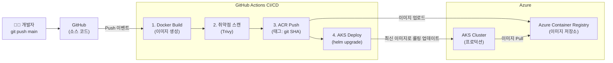

# ACR + CI/CD 파이프라인

## 개요

프로덕션 AI 서비스의 배포는 개발자가 코드를 `git push`하는 순간부터 **자동화**되어야 합니다. Azure에서는 **Azure Container Registry (ACR)** 를 중앙 이미지 저장소로 두고, **GitHub Actions**가 이미지를 빌드·푸시하며, AKS가 최신 이미지를 자동으로 배포하는 파이프라인을 구성합니다.



---

## 1. Azure Container Registry (ACR)

**ACR**은 Docker 컨테이너 이미지와 Helm Chart를 저장하는 **Azure 네이티브 프라이빗 레지스트리**입니다.

### ACR 생성 및 기본 설정

```bash
# ACR 생성 (Premium SKU: Geo-replication, Private Link 지원)
az acr create \
  --resource-group my-rg \
  --name myacrregistry \
  --sku Premium \
  --admin-enabled false   # 관리자 계정 비활성화 (Managed Identity 사용)

# AKS에 ACR 연결 (이미지 Pull 권한 자동 부여)
az aks update \
  --resource-group my-rg \
  --name my-aks \
  --attach-acr myacrregistry
```

### ACR SKU 비교

| SKU | 저장용량 | Geo-replication | Private Link | 추천 환경 |
| :--- | :--- | :--- | :--- | :--- |
| Basic | 10GB | ❌ | ❌ | 개발/테스트 |
| Standard | 100GB | ❌ | ❌ | 소규모 프로덕션 |
| **Premium** | 500GB | ✅ | ✅ | **엔터프라이즈 프로덕션** |

### Geo-replication (지역 복제)

글로벌 서비스라면 여러 Azure 리전에 이미지를 복제하여 **AKS 파드가 가장 가까운 레지스트리에서 이미지를 Pull**하도록 합니다.

```bash
# 한국 중부에 추가 복제본 생성
az acr replication create \
  --registry myacrregistry \
  --location koreacentral
```

### ACR Tasks: 자동 이미지 빌드

코드 Push 시 ACR이 직접 이미지를 빌드하게 할 수도 있습니다 (GitHub Actions 없이도 가능).

```bash
# GitHub 저장소 코드 변경 시 자동 빌드
az acr task create \
  --registry myacrregistry \
  --name auto-build \
  --image ai-app:{{.Run.ID}} \
  --context https://github.com/my-org/ai-app.git \
  --branch main \
  --file Dockerfile \
  --git-access-token <PAT>
```

---

## 2. GitHub Actions CI/CD 파이프라인

### Workload Identity Federation: 비밀번호 없는 CI/CD

> [!IMPORTANT]
> GitHub Actions에서 Azure에 배포할 때 Service Principal의 비밀번호(`client_secret`)를 GitHub Secrets에 저장하는 방식은 **보안 취약점**입니다. **Workload Identity Federation**을 사용하면 비밀번호 없이 OIDC 토큰으로 인증할 수 있습니다.

```bash
# GitHub Actions용 Federated Credential 생성
az ad app create --display-name github-actions-app
az ad sp create --id <app-id>

az ad app federated-credential create \
  --id <app-id> \
  --parameters '{
    "name": "github-actions",
    "issuer": "https://token.actions.githubusercontent.com",
    "subject": "repo:my-org/ai-app:ref:refs/heads/main",
    "audiences": ["api://AzureADTokenExchange"]
  }'

# 필요한 역할 부여
az role assignment create \
  --assignee <sp-object-id> \
  --role AcrPush \
  --scope /subscriptions/.../registries/myacrregistry
```

### 완성된 GitHub Actions 워크플로우

```yaml
# .github/workflows/deploy.yml
name: Build and Deploy to AKS

on:
  push:
    branches: [main]

permissions:
  id-token: write   # Workload Identity Federation 필수
  contents: read

env:
  ACR_NAME: myacrregistry
  IMAGE_NAME: ai-app
  AKS_CLUSTER: my-aks
  RESOURCE_GROUP: my-rg
  NAMESPACE: production

jobs:
  build-and-deploy:
    runs-on: ubuntu-latest
    steps:
      # 1. 소스 코드 체크아웃
      - name: Checkout code
        uses: actions/checkout@v4

      # 2. Azure 로그인 (비밀번호 없이 OIDC 토큰으로)
      - name: Azure Login
        uses: azure/login@v2
        with:
          client-id: ${{ secrets.AZURE_CLIENT_ID }}
          tenant-id: ${{ secrets.AZURE_TENANT_ID }}
          subscription-id: ${{ secrets.AZURE_SUBSCRIPTION_ID }}

      # 3. ACR 로그인
      - name: Login to ACR
        run: az acr login --name ${{ env.ACR_NAME }}

      # 4. Docker 이미지 빌드 및 푸시
      - name: Build and push image
        run: |
          IMAGE_TAG=${{ env.ACR_NAME }}.azurecr.io/${{ env.IMAGE_NAME }}:${{ github.sha }}
          docker build -t $IMAGE_TAG .
          docker push $IMAGE_TAG
          echo "IMAGE_TAG=$IMAGE_TAG" >> $GITHUB_ENV

      # 5. 컨테이너 이미지 취약점 스캔 (Trivy)
      - name: Scan image for vulnerabilities
        uses: aquasecurity/trivy-action@master
        with:
          image-ref: ${{ env.IMAGE_TAG }}
          format: 'sarif'
          exit-code: '1'          # CRITICAL 취약점 발견 시 파이프라인 중단
          severity: 'CRITICAL'

      # 6. AKS 자격증명 설정
      - name: Get AKS credentials
        run: |
          az aks get-credentials \
            --resource-group ${{ env.RESOURCE_GROUP }} \
            --name ${{ env.AKS_CLUSTER }}

      # 7. Helm으로 AKS에 배포
      - name: Deploy to AKS via Helm
        run: |
          helm upgrade --install ai-app ./helm/ai-app \
            --namespace ${{ env.NAMESPACE }} \
            --create-namespace \
            --set image.repository=${{ env.ACR_NAME }}.azurecr.io/${{ env.IMAGE_NAME }} \
            --set image.tag=${{ github.sha }} \
            --wait \
            --timeout 10m

      # 8. 배포 상태 확인
      - name: Verify deployment
        run: |
          kubectl rollout status deployment/ai-app \
            --namespace ${{ env.NAMESPACE }} \
            --timeout=300s
```

---

## 3. Helm Chart 구조

```
helm/ai-app/
├── Chart.yaml
├── values.yaml          # 기본값 (개발환경)
├── values.prod.yaml     # 프로덕션 오버라이드 값
└── templates/
    ├── deployment.yaml
    ├── service.yaml
    ├── ingress.yaml
    ├── hpa.yaml          # Horizontal Pod Autoscaler
    └── serviceaccount.yaml  # Workload Identity 연결
```

```yaml
# values.prod.yaml (프로덕션 환경 오버라이드)
replicaCount: 3

image:
  repository: myacrregistry.azurecr.io/ai-app
  pullPolicy: Always

resources:
  requests:
    memory: "1Gi"
    cpu: "500m"
  limits:
    memory: "2Gi"
    cpu: "1000m"

autoscaling:
  enabled: true
  minReplicas: 3
  maxReplicas: 20
  targetCPUUtilizationPercentage: 70

serviceAccount:
  annotations:
    azure.workload.identity/client-id: <managed-identity-client-id>
```

---

## 4. 이미지 태깅 전략

| 태그 | 형식 | 사용 | 설명 |
| :--- | :--- | :--- | :--- |
| `latest` | ❌ 지양 | 개발용 | 어떤 버전인지 불명확, 프로덕션 금지 |
| `git-sha` | `abc1234` | **프로덕션 표준** | 특정 커밋과 이미지 1:1 대응으로 재현성 보장 |
| `semver` | `v1.2.3` | 릴리즈 | GitHub Release 태그와 연동 |
| `환경-날짜` | `prod-20260406` | 날짜 추적 필요 시 | 특정 날짜 배포 빠른 식별 |

---

## 관련 문서

- **[AKS 설계 및 운영](./aks.md)**: CI/CD가 배포하는 대상 클러스터
- **[보안 & 인증](./security-identity.md)**: Workload Identity Federation 상세, ACR 접근 제어
- **[네트워크](./networking.md)**: Private Endpoint로 격리된 ACR 구성
