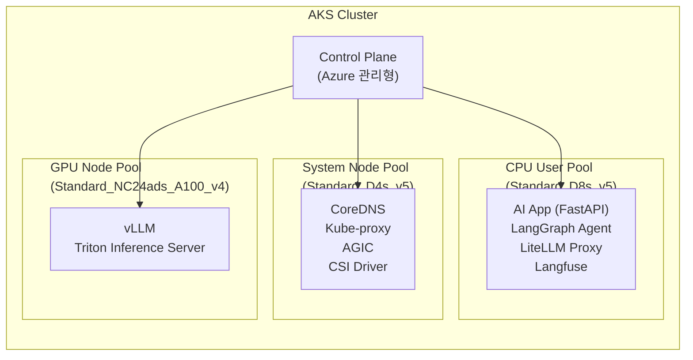
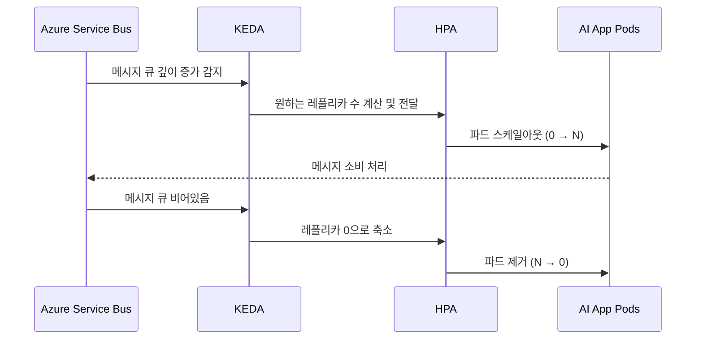
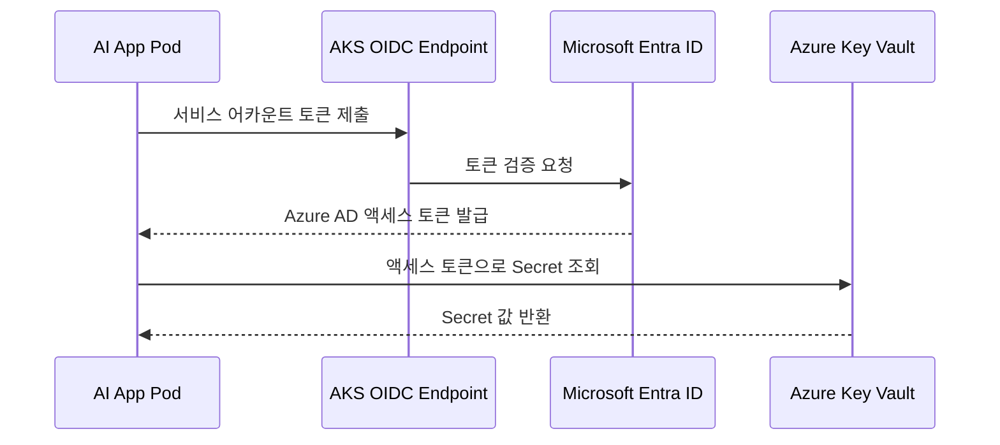
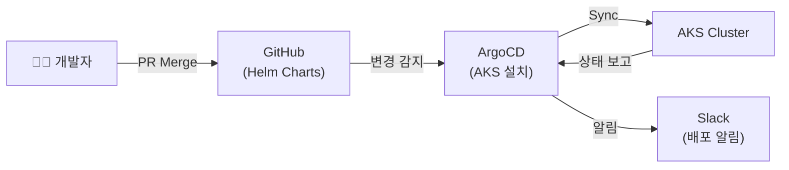
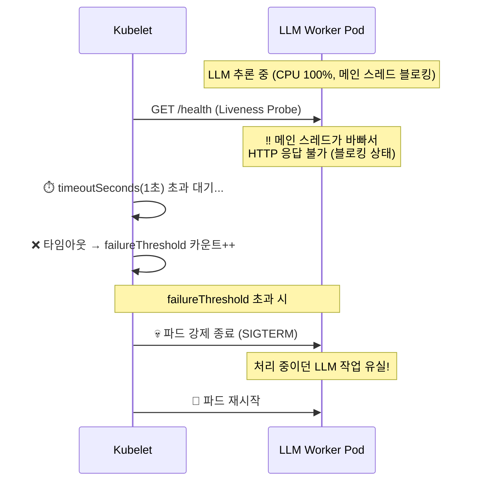
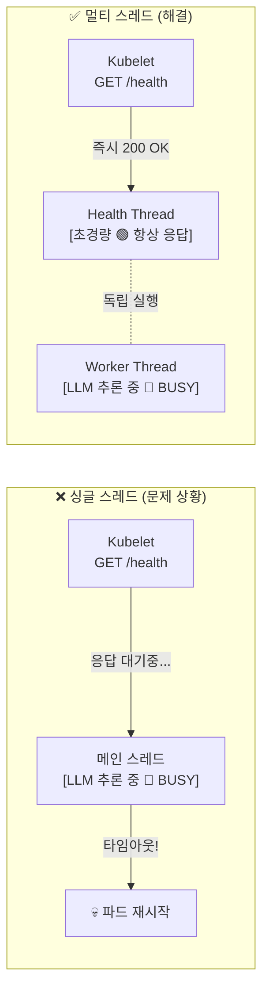
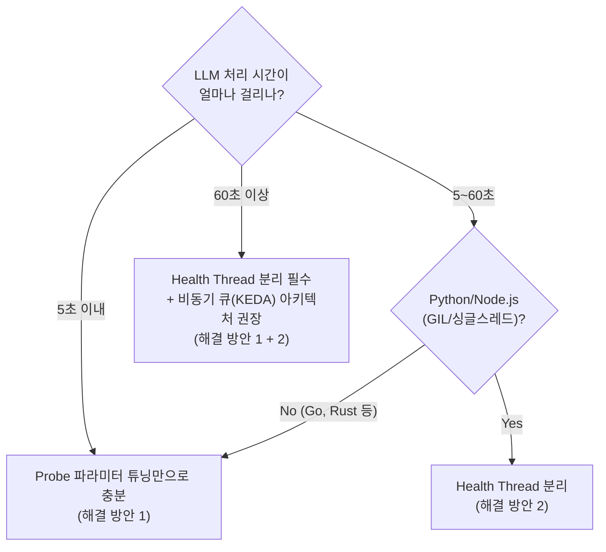

# AKS: Azure Kubernetes Service

## 개요

**AKS(Azure Kubernetes Service)** 는 Azure가 Kubernetes 컨트롤 플레인(Control Plane)을 직접 관리해 주는 **완전 관리형(Managed) Kubernetes 서비스**입니다. AI 서비스 배포에 있어 AKS는 다음과 같은 이유로 핵심 플랫폼이 됩니다.

- **Azure 네이티브 통합**: ACR, Key Vault, Managed Identity, Azure Monitor와 별도 설정 없이 연동
- **GPU 노드풀 지원**: `Standard_NC`, `Standard_ND` 시리즈 GPU VM으로 AI 추론 워크로드 전담 노드풀 구성 가능
- **엔터프라이즈 보안**: Microsoft Entra ID(구 Azure AD) 통합, Azure Policy, Defender for Containers 지원

---

## 1. 클러스터 아키텍처 설계

AI 서비스를 위한 AKS 클러스터는 워크로드의 성격에 따라 **노드풀(Node Pool)을 분리**하는 것이 핵심입니다.



### 노드풀 분리 이유

| 노드풀 | VM SKU | 목적 |
| :--- | :--- | :--- |
| **System Pool** | Standard_D4s_v5 | K8s 핵심 컴포넌트 전용 (분리하지 않으면 앱 파드와 리소스 경쟁) |
| **CPU User Pool** | Standard_D8s_v5 | AI 앱, API 서버, 벡터 DB 클라이언트 등 일반 워크로드 |
| **GPU Node Pool** | Standard_NC시리즈 | vLLM, 모델 추론 전담. `Taint`(오염) 설정으로 다른 워크로드 차단 |

### GPU 노드풀 설정 예시

```bash
# GPU 노드풀 추가 (A100 기준)
az aks nodepool add \
  --resource-group my-rg \
  --cluster-name my-aks \
  --name gpupool \
  --vm-size Standard_NC24ads_A100_v4 \
  --node-count 1 \
  --min-count 0 \
  --max-count 3 \
  --enable-cluster-autoscaler \
  --node-taints "sku=gpu:NoSchedule" \
  --labels "sku=gpu"
```

GPU Pod에서는 다음과 같이 `toleration`과 `resources`를 지정합니다.

```yaml
# vllm-deployment.yaml (일부)
spec:
  tolerations:
    - key: "sku"
      operator: "Equal"
      value: "gpu"
      effect: "NoSchedule"
  containers:
    - name: vllm
      resources:
        limits:
          nvidia.com/gpu: 1
```

---

## 2. 오토스케일링 전략

### A. Cluster Autoscaler (노드 수준 스케일링)

노드풀에 `--enable-cluster-autoscaler`를 설정하면, 파드가 `Pending` 상태가 될 때 자동으로 노드를 추가하고 유휴 노드를 제거합니다.

- **Scale-out**: 스케줄링 불가능한 파드 감지 → 수 분 내 새 노드 프로비저닝
- **Scale-in**: 노드 리소스 사용률 10분 이상 낮을 때 → 노드 안전하게 제거 (drain 후 삭제)
- **GPU 특이사항**: GPU 노드는 `min-count: 0`으로 설정하여 유휴 시 비용 절감 가능

### B. KEDA: 이벤트 기반 파드 오토스케일링

**KEDA(Kubernetes Event-driven Autoscaling)** 는 HPA(Horizontal Pod Autoscaler)를 확장하여, **메시지 큐 깊이**, **HTTP 요청 수**, **Azure 서비스 메트릭** 등 다양한 이벤트 소스를 기반으로 파드를 스케일링합니다.



```yaml
# keda-scaledobject.yaml
apiVersion: keda.sh/v1alpha1
kind: ScaledObject
metadata:
  name: ai-app-scaler
spec:
  scaleTargetRef:
    name: ai-app-deployment
  minReplicaCount: 1
  maxReplicaCount: 20
  triggers:
    - type: azure-servicebus
      metadata:
        queueName: ai-task-queue
        namespace: my-servicebus-namespace
        messageCount: "5"   # 파드 1개당 처리할 메시지 수
```

---

## 3. Workload Identity: 비밀번호 없는 Pod 인증

AKS의 **Workload Identity**는 각 파드에 Azure 리소스(Key Vault, ACR 등) 접근 권한을 **Managed Identity**와 연결해 줍니다. `.env` 파일이나 시크릿에 Service Principal 비밀번호를 저장할 필요가 없습니다.



### 설정 순서 (요약)

```bash
# 1. AKS에 OIDC Issuer + Workload Identity 활성화
az aks update --resource-group my-rg --name my-aks \
  --enable-oidc-issuer --enable-workload-identity

# 2. Managed Identity 생성
az identity create --name my-app-identity --resource-group my-rg

# 3. Key Vault에 역할 부여
az role assignment create \
  --role "Key Vault Secrets User" \
  --assignee <identity-client-id> \
  --scope /subscriptions/.../vaults/my-kv

# 4. Federated Credential 등록 (K8s SA와 연결)
az identity federated-credential create \
  --name my-app-fed \
  --identity-name my-app-identity \
  --resource-group my-rg \
  --issuer <oidc-issuer-url> \
  --subject system:serviceaccount:default:my-app-sa
```

---

## 4. GitOps 배포: Helm + ArgoCD

프로덕션 AKS 클러스터는 직접 `kubectl apply`를 실행하는 대신, **GitOps** 패턴으로 Git 저장소의 상태를 클러스터에 자동 동기화합니다.



```bash
# ArgoCD Application 생성 예시
argocd app create ai-app \
  --repo https://github.com/my-org/helm-charts \
  --path charts/ai-app \
  --dest-server https://kubernetes.default.svc \
  --dest-namespace production \
  --sync-policy automated \
  --auto-prune \
  --self-heal
```

---

## 5. LLM 워크로드 안정화: Health Check Probe 튜닝

> [!WARNING]
> LLM 추론처럼 CPU를 100% 점유하는 무거운 작업을 AKS에 올리면, 가장 흔하게 겪는 치명적 문제가 바로 **"열심히 일하는 파드가 Health Check 실패로 강제 재시작"** 되는 현상입니다. 스펙 부족이 아닌, **K8s 상태 검사 메커니즘과 애플리케이션 스레드 처리 방식의 충돌**이 원인입니다.

### 문제 원인: 메인 스레드 병목



**특히 Python(GIL), Node.js(싱글 스레드) 환경에서 빈번하게 발생합니다.**

---

### Liveness vs Readiness Probe: 목적 명확히 구분

| Probe | 판단 기준 | 실패 시 동작 | LLM 워크로드 전략 |
| :--- | :--- | :--- | :--- |
| **Liveness** | "파드가 완전히 죽었는가?" | 파드 **재시작** | 타임아웃을 LLM 최대 처리 시간보다 넉넉하게 설정 |
| **Readiness** | "파드가 새 트래픽을 받을 준비가 됐는가?" | Service 라우팅 **제외** (파드는 살아있음) | 작업 중엔 의도적으로 503 반환 → 파드는 안 죽고 작업 완료 |

---

### 해결 방안 1: Probe 파라미터 튜닝 (쿠버네티스 레벨)

기본값은 LLM 추론에 너무 짧습니다. Helm values.yaml에서 다음과 같이 넉넉하게 설정합니다.

```yaml
# values.prod.yaml (LLM Worker 파드 기준)
livenessProbe:
  httpGet:
    path: /health/live
    port: 8000
  initialDelaySeconds: 60    # 모델 로딩 완료까지 기다리는 시간
  periodSeconds: 30           # 30초마다 검사
  timeoutSeconds: 30          # LLM 최대 처리 시간보다 넉넉하게
  failureThreshold: 3         # 3번 연속 실패해야 재시작 (총 90초 유예)
  successThreshold: 1

readinessProbe:
  httpGet:
    path: /health/ready       # ← Liveness와 다른 엔드포인트 분리
    port: 8000
  initialDelaySeconds: 30
  periodSeconds: 10
  timeoutSeconds: 5
  failureThreshold: 3         # 실패해도 재시작 없음, Service에서만 제외됨
```

---

### 해결 방안 2: Health Check 전용 스레드 분리 (애플리케이션 레벨)

**가장 근본적인 해결책**입니다. LLM 추론은 백그라운드 워커에서, Health Check 응답은 별도 경량 스레드에서 독립적으로 처리합니다.



**Python FastAPI 구현 예시:**

```python
# main.py
import asyncio
import threading
from fastapi import FastAPI

app = FastAPI()

# ── Health Check 전용 엔드포인트 (항상 즉시 응답) ──────────────
@app.get("/health/live")
async def liveness():
    """Liveness: 프로세스가 살아있는지 확인. 항상 즉시 200 반환."""
    return {"status": "alive"}

@app.get("/health/ready")
async def readiness():
    """Readiness: 새 작업을 받을 수 있는지 확인."""
    if worker.is_busy():
        # 503 반환 → K8s가 파드를 Service에서 제외 (재시작 X)
        from fastapi import HTTPException
        raise HTTPException(status_code=503, detail="Worker busy")
    return {"status": "ready"}

# ── LLM 추론 엔드포인트 (블로킹 가능) ────────────────────────
@app.post("/api/chat")
async def chat(request: ChatRequest):
    # asyncio를 사용해 블로킹 작업을 별도 스레드로 오프로드
    loop = asyncio.get_event_loop()
    result = await loop.run_in_executor(
        None,                       # ThreadPoolExecutor 사용
        run_llm_inference,          # 실제 LLM 추론 함수 (블로킹 OK)
        request.message
    )
    return {"response": result}

class LLMWorker:
    def __init__(self):
        self._busy = False

    def is_busy(self) -> bool:
        return self._busy

    def run(self, task):
        self._busy = True
        try:
            return perform_llm_call(task)  # 무거운 작업
        finally:
            self._busy = False             # 항상 초기화

worker = LLMWorker()
```

---

### 해결 방안 3: 파일 기반 상태 검사 (exec 방식)

HTTP 요청이 스레드 병목 때문에 응답이 안 된다면, **OS 파일 시스템에 직접 접근**하는 exec 방식을 사용합니다. 파일 I/O는 애플리케이션 스레드 상태와 무관하게 즉시 응답합니다.

```python
# 앱 내부에서: 살아있는 동안 10초마다 파일 업데이트
import threading, time, pathlib

def heartbeat():
    while True:
        pathlib.Path("/tmp/healthy").touch()   # 파일 수정 시간 갱신
        time.sleep(10)

threading.Thread(target=heartbeat, daemon=True).start()
```

```yaml
# deployment.yaml: HTTP 대신 파일 존재 여부로 Liveness 검사
livenessProbe:
  exec:
    command:
      - /bin/sh
      - -c
      - "test $(( $(date +%s) - $(stat -c %Y /tmp/healthy) )) -lt 30"
      # 파일이 최근 30초 이내에 수정됐는지 확인
  initialDelaySeconds: 30
  periodSeconds: 15
  failureThreshold: 3
```

---

### 전략 선택 가이드



---

## 6. 핵심 AKS CLI 명령어 요약

```bash
# 클러스터 자격증명 가져오기 (kubectl 연결)
az aks get-credentials --resource-group my-rg --name my-aks

# 모든 노드 상태 확인
kubectl get nodes -o wide

# 특정 네임스페이스 파드 상태 확인
kubectl get pods -n production -o wide

# 파드 로그 스트리밍
kubectl logs -f deployment/ai-app -n production

# 노드 리소스 사용량 확인
kubectl top nodes

# 파드 리소스 사용량 확인
kubectl top pods -n production

# 긴급 스케일링 (수동)
kubectl scale deployment ai-app --replicas=10 -n production

# 롤링 업데이트 상태 확인
kubectl rollout status deployment/ai-app -n production

# 이전 버전으로 롤백
kubectl rollout undo deployment/ai-app -n production

# 파드 재시작 횟수 및 원인 확인
kubectl describe pod <pod-name> -n production | grep -A 10 "Events:"
```

---

## 관련 문서

- **[네트워크: App Gateway와 VNet](./networking.md)**: AKS로 들어오는 트래픽 제어
- **[ACR + CI/CD](./acr-cicd.md)**: AKS에 배포되는 컨테이너 이미지 관리
- **[보안 & 인증](./security-identity.md)**: Key Vault, Managed Identity 상세
- **[K9s](../ax-infra/k9s.md)**: AKS 클러스터 실시간 터미널 모니터링 도구
