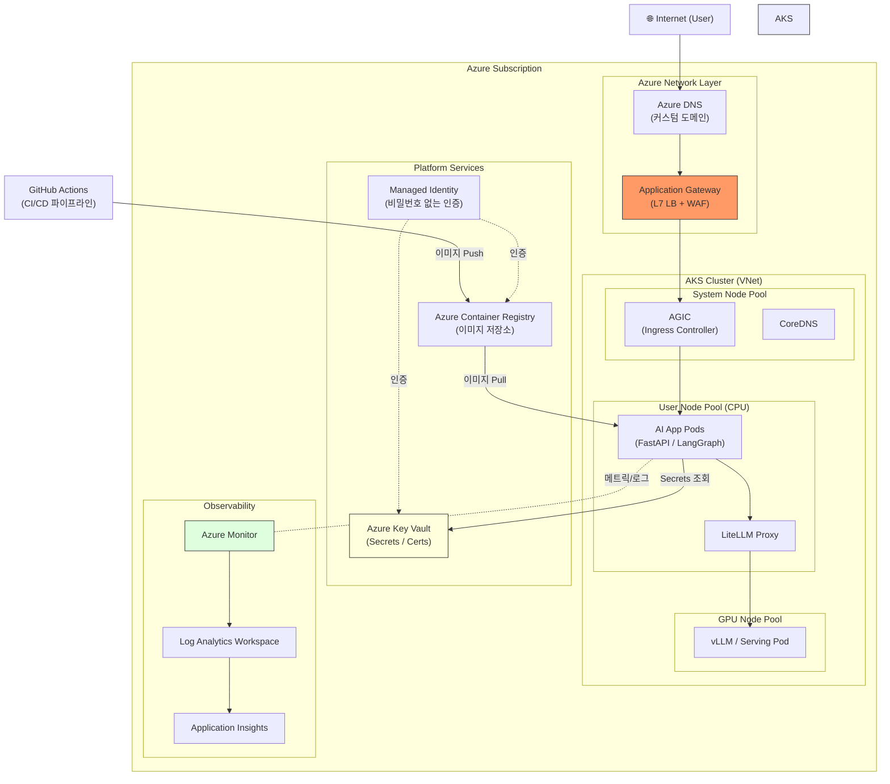

# Azure Cloud AI 프로덕션 배포

## 개요

AI 서비스를 PoC(Proof of Concept) 수준에서 실제 **프로덕션(Production)** 환경으로 끌어올릴 때, 클라우드 인프라 설계가 그 성패를 좌우합니다. 이 섹션에서는 **Azure Cloud**를 기반으로 AI 서비스를 안정적이고 확장 가능하게 배포하는 데 필요한 핵심 서비스들을 다룹니다.

Azure는 **AKS(Azure Kubernetes Service)** 를 중심으로 한 컨테이너 오케스트레이션, **Application Gateway** 를 통한 보안 트래픽 관리, **Azure Monitor** 기반의 통합 관측성 등 엔터프라이즈급 AI 배포를 위한 완성된 생태계를 제공합니다.

---

## 전체 아키텍처

AI 서비스가 인터넷 사용자 요청을 받아 처리하기까지의 전체 데이터/제어 흐름입니다.

---

## 핵심 서비스 역할 요약

| 서비스 | 범주 | 역할 |
| :--- | :--- | :--- |
| **AKS** | 컴퓨팅 | 컨테이너 오케스트레이션, 오토스케일링 |
| **Application Gateway** | 네트워크 | L7 로드밸런싱, WAF, TLS 종단 처리 |
| **Azure Virtual Network** | 네트워크 | 격리된 사설 네트워크 환경 구성 |
| **Azure Container Registry** | DevOps | 컨테이너 이미지 저장 및 배포 |
| **Azure Key Vault** | 보안 | API 키, 인증서, 시크릿 통합 관리 |
| **Managed Identity** | 보안/인증 | 비밀번호 없이 Azure 서비스 간 인증 |
| **Azure Monitor** | 관측성 | 메트릭, 로그, 경보(Alert) 통합 |
| **Log Analytics** | 관측성 | 로그 중앙 수집 및 쿼리(KQL) |
| **Application Insights** | 관측성 | 애플리케이션 수준 분산 추적, APM |

---

## 학습 내용

### 1. [AKS: Azure Kubernetes Service](./aks.md)
AI 워크로드를 위한 Kubernetes 클러스터 설계, 노드풀 구성, 오토스케일링(KEDA), GitOps 기반 배포.

### 2. [네트워크: VNet, App Gateway, Ingress](./networking.md)
서브넷 설계, Application Gateway WAF, AGIC(App Gateway Ingress Controller), Private Endpoint를 통한 네트워크 격리.

### 3. [ACR + CI/CD 파이프라인](./acr-cicd.md)
Azure Container Registry 이미지 관리, GitHub Actions를 통한 빌드→푸시→배포 자동화.

### 4. [보안 & 인증 (Key Vault, Managed Identity)](./security-identity.md)
Managed Identity 기반 비밀번호 없는 인증, Key Vault Secrets 연동, Workload Identity, Azure RBAC.

### 5. [모니터링 & 옵저버빌리티](./observability.md)
Azure Monitor, Log Analytics, Container Insights, Application Insights를 통한 AI 서비스 전체 관측.

---

## 관련 문서

- **[인프라 배포 및 운영 전략 (Kubernetes & Docker)](../ax-infra/deployment.md)**: Kubernetes 일반 배포 전략 (클라우드 공급자 무관)
- **[K9s](../ax-infra/k9s.md)**: AKS 클러스터를 터미널에서 실시간 모니터링하는 TUI 도구
- **[LLMOps](../llmops/index.md)**: LLM 애플리케이션 수준의 관측성 (Langfuse, LangSmith)
- **[Argo CD (GitOps CD 도구)](../ax-infra/argocd.md)**: GitOps 기반 CD 도구 (클라우드 무관)
- **[Kubernetes Ingress & AGIC](../ax-infra/ingress.md)**: L7 라우팅 핵심 개념 및 AGIC 연동
- **[Istio (Service Mesh)](../ax-infra/istio.md)**: 클러스터 내부 East-West 트래픽 제어
