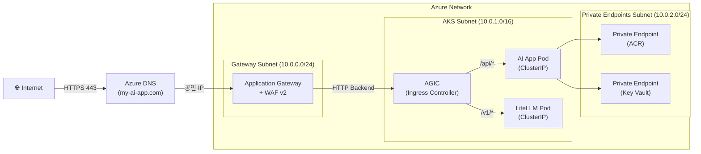
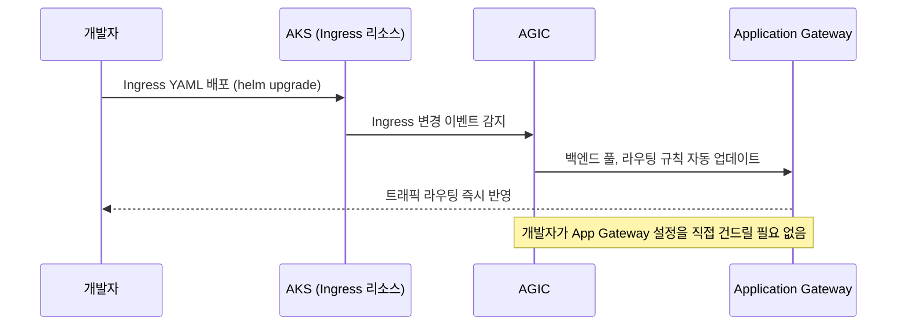

# 네트워크: VNet, Application Gateway, Ingress

## 개요

AI 서비스가 외부 사용자에게 안전하게 노출되려면, 잘 설계된 **네트워크 레이어**가 필수입니다. Azure에서는 **Virtual Network(VNet)** 을 통해 격리된 사설 네트워크를 구성하고, **Application Gateway + WAF**로 외부 트래픽을 필터링한 뒤, **AGIC(Application Gateway Ingress Controller)** 를 통해 AKS 내부 서비스로 라우팅합니다.



---

## 1. Azure Virtual Network (VNet) 설계

VNet은 Azure 리소스들이 사설 IP로 통신하는 **격리된 네트워크 공간**입니다. AI 서비스 배포에서는 역할별로 서브넷을 분리하는 것이 보안과 운영의 기본입니다.

### 권장 서브넷 구성

| 서브넷 | CIDR | 용도 |
| :--- | :--- | :--- |
| `gateway-subnet` | 10.0.0.0/24 | Application Gateway 전용 (AGW는 전용 서브넷 필요) |
| `aks-subnet` | 10.0.1.0/16 | AKS 노드 및 파드 IP 대역 (노드 수에 따라 크게 설정) |
| `private-endpoint-subnet` | 10.0.2.0/24 | ACR, Key Vault Private Endpoint |

> [!TIP]
> AKS 서브넷의 CIDR은 **넉넉하게** 잡아야 합니다. Azure CNI 방식의 AKS는 파드 하나당 VNet IP를 소비합니다. 파드 수 × 노드 수를 고려해 `/16` (65,534개) 수준을 권장합니다.

### AKS와 VNet 통합 (Azure CNI)

```bash
# VNet과 서브넷 생성
az network vnet create \
  --resource-group my-rg \
  --name my-vnet \
  --address-prefix 10.0.0.0/8

az network vnet subnet create \
  --resource-group my-rg \
  --vnet-name my-vnet \
  --name aks-subnet \
  --address-prefix 10.0.1.0/16

# AKS를 VNet에 통합하여 생성 (Azure CNI)
az aks create \
  --resource-group my-rg \
  --name my-aks \
  --network-plugin azure \
  --vnet-subnet-id /subscriptions/.../subnets/aks-subnet \
  --enable-workload-identity \
  --enable-oidc-issuer
```

---

## 2. Azure Application Gateway + WAF

**Azure Application Gateway**는 **L7(HTTP/HTTPS) 로드밸런서**로, 단순 트래픽 분산을 넘어 다음 기능을 제공합니다.

### 핵심 기능

| 기능 | 설명 |
| :--- | :--- |
| **SSL/TLS 종단 처리** | 외부 HTTPS 요청의 인증서를 App Gateway에서 처리, 내부는 HTTP로 통신 |
| **WAF (Web Application Firewall)** | OWASP Top 10 공격(SQL Injection, XSS 등) 자동 차단 |
| **URL 기반 라우팅** | `/api/*` → AI App, `/v1/*` → LiteLLM Proxy 등 경로별 분기 |
| **세션 고정 (Session Affinity)** | 동일 사용자 요청을 동일 파드로 전달 |
| **자동 스케일링** | 트래픽에 따라 Application Gateway 인스턴스 수 자동 조절 |

### WAF 정책 설정 예시

```bash
# WAF 정책 생성 (OWASP 3.2 규칙셋)
az network application-gateway waf-policy create \
  --name my-waf-policy \
  --resource-group my-rg \
  --type OWASP \
  --version 3.2

# Application Gateway v2 SKU 생성 (WAF 포함)
az network application-gateway create \
  --name my-app-gw \
  --resource-group my-rg \
  --sku WAF_v2 \
  --capacity 2 \
  --vnet-name my-vnet \
  --subnet gateway-subnet \
  --public-ip-address my-public-ip \
  --waf-policy my-waf-policy
```

---

## 3. AGIC: Application Gateway Ingress Controller

**AGIC**는 AKS 클러스터 내부에서 실행되며, Kubernetes `Ingress` 리소스의 변경을 감지해 **Application Gateway의 라우팅 규칙을 자동으로 업데이트**해주는 컨트롤러입니다.



### AKS에 AGIC 설치 (Add-on 방식 권장)

```bash
# AGIC Add-on 활성화 (AKS + App Gateway 연결)
az aks enable-addons \
  --resource-group my-rg \
  --name my-aks \
  --addons ingress-appgw \
  --appgw-id /subscriptions/.../applicationGateways/my-app-gw
```

### Kubernetes Ingress 리소스 예시

```yaml
# ai-app-ingress.yaml
apiVersion: networking.k8s.io/v1
kind: Ingress
metadata:
  name: ai-app-ingress
  namespace: production
  annotations:
    kubernetes.io/ingress.class: azure/application-gateway
    appgw.ingress.kubernetes.io/ssl-redirect: "true"
    appgw.ingress.kubernetes.io/waf-policy-for-path: /subscriptions/.../wafPolicies/my-waf-policy
spec:
  tls:
    - hosts:
        - my-ai-app.com
      secretName: tls-secret   # cert-manager로 자동 발급 가능
  rules:
    - host: my-ai-app.com
      http:
        paths:
          - path: /api
            pathType: Prefix
            backend:
              service:
                name: ai-app-service
                port:
                  number: 8000
          - path: /v1
            pathType: Prefix
            backend:
              service:
                name: litellm-service
                port:
                  number: 4000
```

---

## 4. Private Endpoint: 서비스 네트워크 격리

**Private Endpoint**는 Azure PaaS 서비스(ACR, Key Vault 등)를 **VNet 내부의 사설 IP 주소로 노출**시켜, 공인 인터넷을 경유하지 않고 접근하게 합니다. 인터넷에서의 직접 접근은 방화벽으로 차단합니다.

### ACR Private Endpoint 설정

```bash
# ACR에 대한 Private Endpoint 생성
az network private-endpoint create \
  --name pe-acr \
  --resource-group my-rg \
  --vnet-name my-vnet \
  --subnet private-endpoint-subnet \
  --private-connection-resource-id /subscriptions/.../registries/myacr \
  --group-id registry \
  --connection-name acr-connection

# ACR 공용 네트워크 접근 비활성화
az acr update --name myacr --public-network-enabled false
```

---

## 5. Azure DNS: 커스텀 도메인 연결

Application Gateway의 공인 IP를 커스텀 도메인에 연결합니다.

```bash
# DNS 존 생성
az network dns zone create --resource-group my-rg --name my-ai-app.com

# A 레코드: 도메인 → App Gateway 공인 IP
az network dns record-set a add-record \
  --resource-group my-rg \
  --zone-name my-ai-app.com \
  --record-set-name "@" \
  --ipv4-address <APP_GW_PUBLIC_IP>
```

---

## 관련 문서

- **[AKS 설계 및 운영](./aks.md)**: 트래픽을 받는 AKS 클러스터 구성
- **[보안 & 인증](./security-identity.md)**: Private Endpoint와 연계되는 Key Vault 보안
- **[ACR + CI/CD](./acr-cicd.md)**: Private Endpoint로 격리된 ACR에 이미지 푸시/풀 설정
