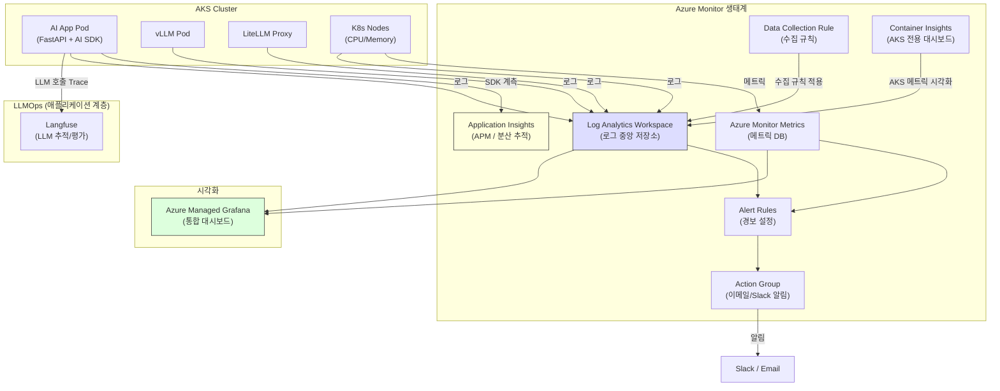
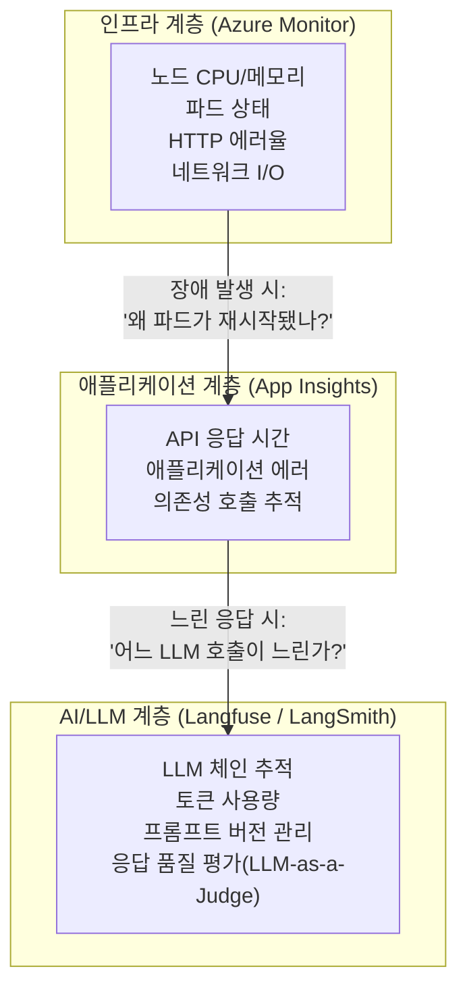

# 모니터링 & 옵저버빌리티

## 개요

프로덕션 AI 서비스에서 "모르는 사이에 장애가 발생하는 것"을 막으려면 강력한 **옵저버빌리티(Observability)** 체계가 필요합니다. Azure에서는 **Azure Monitor**를 중심으로 인프라부터 애플리케이션, AI 모델 응답까지 전 계층을 관측할 수 있는 통합 플랫폼을 제공합니다.

### 옵저버빌리티 3대 축 (Pillars of Observability)

| Pillar | 도구 | 설명 |
| :--- | :--- | :--- |
| **Metrics (메트릭)** | Azure Monitor, Container Insights | CPU, 메모리, HTTP 응답률, 레이턴시 등 수치 데이터 |
| **Logs (로그)** | Log Analytics Workspace | 애플리케이션 로그, 시스템 이벤트, 에러 추적 |
| **Traces (추적)** | Application Insights | 하나의 요청이 여러 서비스를 거치는 흐름을 E2E로 추적 |

---

## Azure 옵저버빌리티 전체 아키텍처



---

## 1. Log Analytics Workspace

**Log Analytics Workspace**는 Azure Monitor 생태계의 **핵심 로그 저장소**입니다. AKS 컨테이너 로그, 인프라 이벤트, 애플리케이션 로그가 모두 이곳에 집결되며, **KQL(Kusto Query Language)** 로 강력한 분석이 가능합니다.

### Workspace 생성 및 AKS 연결

```bash
# Log Analytics Workspace 생성
az monitor log-analytics workspace create \
  --resource-group my-rg \
  --workspace-name my-log-workspace \
  --location koreacentral \
  --retention-time 90   # 로그 보존 기간 (일). 최대 730일

WORKSPACE_ID=$(az monitor log-analytics workspace show \
  --resource-group my-rg \
  --workspace-name my-log-workspace \
  --query id -o tsv)

# AKS에 Container Insights 활성화 (Log Analytics 연결)
az aks enable-addons \
  --resource-group my-rg \
  --name my-aks \
  --addons monitoring \
  --workspace-resource-id $WORKSPACE_ID
```

### 유용한 KQL 쿼리 예시

```kql
// 지난 1시간 동안 에러 로그 조회
ContainerLog
| where TimeGenerated > ago(1h)
| where LogEntry contains "ERROR"
| project TimeGenerated, ContainerName, LogEntry
| order by TimeGenerated desc
| limit 100

// 네임스페이스별 파드 재시작 횟수 집계
KubePodInventory
| where TimeGenerated > ago(24h)
| where Namespace == "production"
| summarize RestartCount = sum(PodRestartCount) by PodName
| order by RestartCount desc

// HTTP 500 에러율 추이
AppRequests
| where TimeGenerated > ago(6h)
| summarize
    TotalRequests = count(),
    ErrorRequests = countif(ResultCode >= 500)
    by bin(TimeGenerated, 5m)
| extend ErrorRate = ErrorRequests * 100.0 / TotalRequests
| render timechart
```

---

## 2. Container Insights: AKS 전용 모니터링

**Container Insights**는 AKS를 위한 사전 구성된 모니터링 뷰를 제공합니다. Log Analytics와 연결하면 Azure Portal에서 AKS 전용 대시보드가 자동으로 활성화됩니다.

### Container Insights에서 확인 가능한 정보

- **Cluster 수준**: 노드 CPU/메모리 사용률, 노드 상태
- **Node 수준**: 파드 수, 디스크 I/O, 네트워크 In/Out
- **Pod 수준**: 컨테이너별 CPU/메모리, 재시작 횟수
- **컨테이너 로그**: 실시간 로그 스트리밍 (Log Analytics로 연동)

---

## 3. Application Insights: APM & 분산 추적

**Application Insights**는 애플리케이션 수준의 **APM(Application Performance Monitoring)** 도구입니다. AI 앱에서 한 사용자 요청이 여러 마이크로서비스와 LLM 호출을 거치는 **End-to-End 분산 추적**이 핵심입니다.

### Python 애플리케이션 계측

```bash
pip install azure-monitor-opentelemetry
```

```python
# main.py
from azure.monitor.opentelemetry import configure_azure_monitor

configure_azure_monitor(
    connection_string="InstrumentationKey=...",  # Key Vault에서 주입
)

# 이후 FastAPI, LangChain 등 주요 라이브러리가 자동 계측됨
from fastapi import FastAPI

app = FastAPI()

@app.post("/chat")
async def chat(request: ChatRequest):
    # 이 함수의 실행 시간, 에러, 요청/응답이 자동으로 App Insights에 기록됨
    response = await agent.run(request.message)
    return {"response": response}
```

### Application Insights에서 추적되는 데이터

| 데이터 | 설명 |
| :--- | :--- |
| **Requests** | API 엔드포인트별 응답 시간, 성공/실패율 |
| **Dependencies** | 외부 API 호출 (OpenAI, Azure AI 등) 레이턴시 |
| **Exceptions** | 예외 스택 트레이스 |
| **Traces** | 사용자 정의 로그 (`logger.info()`) |
| **Live Metrics** | 현재 요청 처리량, 서버 상태 실시간 확인 |

---

## 4. Alert Rules: 자동 경보 설정

이상 징후를 **사람이 직접 대시보드를 보기 전에** 먼저 알릴 수 있도록 Alert을 설정합니다.

### 핵심 Alert 정의 예시

```bash
# AKS 노드 CPU 80% 초과 시 경보
az monitor metrics alert create \
  --name "High CPU Alert" \
  --resource-group my-rg \
  --scopes /subscriptions/.../managedClusters/my-aks \
  --condition "avg Percentage CPU > 80" \
  --window-size 5m \
  --evaluation-frequency 1m \
  --severity 2 \
  --action-group my-action-group

# HTTP 5xx 에러율 5% 초과 시 경보 (Log Analytics 기반)
az monitor scheduled-query create \
  --resource-group my-rg \
  --name "High Error Rate Alert" \
  --scopes /subscriptions/.../workspaces/my-log-workspace \
  --condition \
    "count 'AppRequests | where ResultCode >= 500 | summarize count()' \
     greater than 50" \
  --window-duration 5m \
  --evaluation-frequency 5m \
  --severity 1 \
  --action-group my-action-group
```

### Action Group (알림 채널) 설정

```bash
# Action Group 생성 (슬랙 + 이메일 알림)
az monitor action-group create \
  --resource-group my-rg \
  --name my-action-group \
  --short-name myag \
  --email-receivers name=admin email=admin@company.com \
  --webhook-receivers name=slack \
    service-uri=https://hooks.slack.com/services/...
```

### 권장 Alert 목록

| Alert 이름 | 조건 | 심각도 |
| :--- | :--- | :--- |
| 노드 CPU 과부하 | CPU > 80% (5분 평균) | 경고(2) |
| 노드 메모리 부족 | Memory > 85% | 경고(2) |
| 파드 CrashLoop | 재시작 > 5회/10분 | 심각(1) |
| HTTP 에러율 급증 | 5xx > 5% | 심각(1) |
| AI API 레이턴시 급증 | P99 > 30초 | 경고(2) |
| 노드 수 부족 | 사용 가능 노드 < 2 | 심각(1) |

---

## 5. Azure Managed Grafana: 통합 대시보드

**Azure Managed Grafana**는 Azure Monitor와 Log Analytics의 데이터를 시각화하는 완전 관리형 Grafana 인스턴스입니다. Azure Portal에서 클릭 몇 번으로 생성하고, Azure 서비스 메트릭을 기본 데이터 소스로 자동 연결합니다.

```bash
# Azure Managed Grafana 인스턴스 생성
az grafana create \
  --name my-ai-grafana \
  --resource-group my-rg

# 기본 대시보드 임포트 (AKS 모니터링용 커뮤니티 대시보드)
# Grafana Dashboard ID: 15760 (Kubernetes Cluster Monitoring)
```

---

## 6. 옵저버빌리티 계층 구조

Azure 인프라 모니터링과 **LLMOps**(LLM 애플리케이션 관측성)는 **상호 보완적**입니다.



- **Azure Monitor + Container Insights**: "파드가 죽었다", "노드 메모리가 부족하다" → **어디서 문제가 발생했나?**
- **Application Insights**: "API 응답이 느리다", "에러가 발생했다" → **어떤 코드 경로에서 문제가 생겼나?**
- **Langfuse / LangSmith**: "LLM 답변 품질이 낮다", "토큰을 너무 많이 쓴다" → **AI 모델 자체의 문제인가?**

---

## 관련 문서

- **[AKS 설계 및 운영](./aks.md)**: 모니터링 대상이 되는 AKS 클러스터
- **[LLMOps](../llmops/index.md)**: LLM 애플리케이션 계층 관측성 (Langfuse, LangSmith, Arize Phoenix)
- **[AX Infra 관측성](../ax-infra/observability.md)**: 에이전트 인프라 관측성 전략
