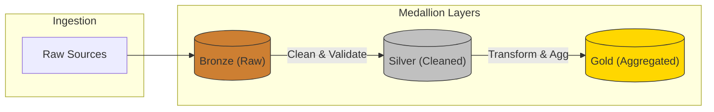

# 데이터 아키텍처 (Medallion & Lakehouse)

## 1. 개요
데이터 아키텍처는 데이터의 생애주기를 관리하는 구조입니다. 데이터 늪(Data Swamp)을 방지하고 신뢰할 수 있는 정보를 제공하기 위해 계층화(Layering) 전략이 필요합니다.

## 2. 메달리온 아키텍처 (Medallion Architecture)
데이터의 품질과 신뢰성에 따라 데이터를 **브론즈(Bronze) - 실버(Silver) - 골드(Gold)** 3가지 계층으로 분리하여 관리하는 기법입니다.

### 1) Bronze Layer (Raw Data)
- **목적**: 원본 데이터의 보존.
- **특징**: 스키마 변경 없이 Append-only 방식으로 저장하여 언제든 재처리가 가능하도록 함.

### 2) Silver Layer (Validated & Cleaned)
- **목적**: "가장 신뢰할 수 있는 전사 데이터(Single Source of Truth)" 제공.
- **특징**: 중복 제거, 결측치 처리, 데이터 타입 통일, 개인정보 마스킹 등이 수행됨.

### 3) Gold Layer (Business Ready)
- **목적**: 비즈니스 의사결정 및 AI 모델용 최종 데이터 공급.
- **특징**: 쿼리 성능을 높이기 위해 역정규화(Denormalization)를 진행하며, 특정 비즈니스 KPI 산출에 최적화됨.

## 3. 데이터 레이크하우스 (Data Lakehouse)
전통적인 **데이터 레이크(Data Lake)**의 유연성과 **데이터 웨어하우스(Data Warehouse)**의 관리 성능을 결합한 최신 아키텍처 패러다임입니다.

- **핵심 기술**: Delta Lake, Apache Iceberg, Apache Hudi.
- **장점**: 데이터 레이크에 저장된 대용량 파일에 대해 트랜잭션(ACID)을 지원하고, SQL로 고성능 쿼리를 수행할 수 있음.

> **[AX 관점의 핵심]**
> 메달리온 아키텍처의 **Gold Layer**는 AI 에이전트가 가장 신뢰할 수 있는 컨텍스트입니다. 잘 정제된 골드 레이어 데이터는 AI의 환각(Hallucination) 현상을 극히 낮추고 높은 정확도를 보장합니다.
