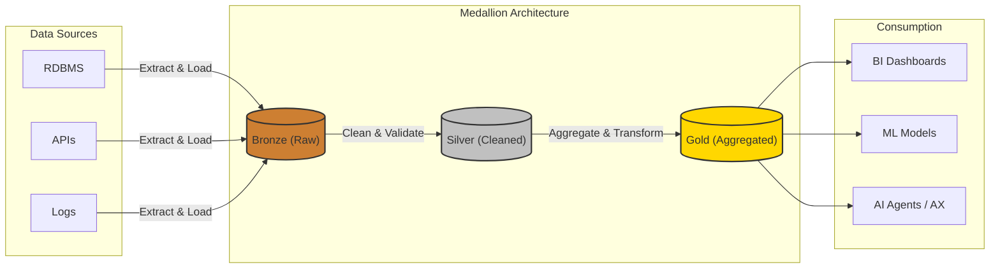

# DX 구현 방법론 및 실무 (데이터 엔지니어링)

앞선 장에서 디지털 전환(DX)의 핵심 개념과 기술을 살펴보았습니다. 이 장에서는 DX를 실제 비즈니스 환경에 성공적으로 안착시키기 위해 필요한 **데이터 엔지니어링 실무 기법**을 다룹니다.

데이터 기반 스택(Data-driven Stack)은 향후 AI 에이전트가 활용할 양질의 컨텍스트를 제공하는, AX로 나아가기 위한 가장 핵심적인 인프라스트럭처입니다.

---

## 1. 데이터 파이프라인의 필요성과 오케스트레이션

데이터 기반 의사결정을 위해서는 사일로(Silo)화 되어 있는 다양한 원천(Database, API, 로그 파일 등)으로부터 데이터를 추출(Extract)하고, 가공(Transform)하여, 최종 목적지(Load)까지 안정적으로 전달하는 **데이터 파이프라인(Data Pipeline)**이 필수적입니다. 이 과정을 흔히 ETL 또는 ELT 파이프라인이라고 부릅니다.

파이프라인이 복잡해짐에 따라 작업들의 선후행 관계(의존성), 성공/실패 시 재시도, 스케줄링 등을 체계적으로 관리해 줄 **데이터 오케스트레이션(Orchestration) 도구**가 필요해집니다.

### Apache Airflow와 DAG (Directed Acyclic Graph)

데이터 관련 워크플로우를 코드로 작성하고(Workflow as Code), 예약하며, 모니터링할 수 있는 가장 대표적인 오픈소스 플랫폼이 **[Apache Airflow](https://airflow.apache.org/)**입니다. 

Airflow는 작업의 흐름을 **DAG(Directed Acyclic Graph, 방향성 비순환 그래프)** 형태로 표현합니다. DAG는 순환(Cycle)이 없는 흐름을 의미하므로 무한 루프에 빠지지 않고 작업이 일정한 방향성을 가지며 진행되도록 보장합니다.

#### Airflow DAG 작성 예시 (Python)
아래는 원천 데이터를 가져와서 가공 후 적재하는 매우 기초적인 Airflow DAG의 예시입니다. (Python Black 포매팅 기준 적용)

```python
from datetime import datetime, timedelta

from airflow import DAG
from airflow.operators.bash import BashOperator
from airflow.operators.python import PythonOperator


def extract_data():
    print("원천 소스에서 데이터를 추출합니다.")
    # 실제 추출 로직 작성


def transform_data():
    print("수집된 데이터를 정제 및 가공합니다.")
    # 실제 데이터 가공/변환 로직 작성


def load_data():
    print("가공된 데이터를 데이터 웨어하우스에 적재합니다.")
    # 실제 데이터 적재 로직 작성


default_args = {
    "owner": "data_engineering_team",
    "depends_on_past": False,
    "email_on_failure": False,
    "email_on_retry": False,
    "retries": 1,
    "retry_delay": timedelta(minutes=5),
}

with DAG(
    "simple_etl_pipeline",
    default_args=default_args,
    description="간단한 ETL 파이프라인 DAG",
    schedule_interval=timedelta(days=1),
    start_date=datetime(2023, 1, 1),
    catchup=False,
    tags=["dx", "etl"],
) as dag:
    
    # 1. 추출 작업
    task_extract = PythonOperator(
        task_id="extract_raw_data",
        python_callable=extract_data,
    )

    # 2. 가공 작업
    task_transform = PythonOperator(
        task_id="transform_data",
        python_callable=transform_data,
    )

    # 3. 적재 작업
    task_load = PythonOperator(
        task_id="load_data_to_dw",
        python_callable=load_data,
    )

    # 4. 품질 검수 완료 알림 (BashOperator 활용)
    task_notify = BashOperator(
        task_id="notify_completion",
        bash_command='echo "데이터 파이프라인 실행이 정상적으로 완료되었습니다."',
    )

    # 작업 간의 의존성(선후행 관계) 설정
    task_extract >> task_transform >> task_load >> task_notify
```

---

## 2. 메달리온 아키텍처 (Medallion Architecture)

파이프라인을 통해 데이터를 중앙 저장소(Data Lake 또는 Data Warehouse)로 모았다면, 이 데이터의 **품질과 신뢰성**을 어떻게 유지할지가 중요한 과제로 떠오릅니다. 데이터 늪(Data Swamp)이 되는 것을 방지하기 위해 데이터의 가공 수준과 품질에 따라 계층을 나누어 관리하는 기법이 바로 **메달리온 아키텍처(Medallion Architecture)**입니다.

### 데이터 흐름 시각화 (Data Processing Flow)



이 구조는 흔히 데이터브릭스(Databricks) 생태계 및 레이크하우스(Lakehouse) 구조에서 널리 쓰이며 데이터를 **브론즈(Bronze) - 실버(Silver) - 골드(Gold)** 3가지 계층으로 분리합니다.

### 1) 브론즈 (Bronze, 원시 데이터 계층)
- **정의**: 원천 시스템에서 추출한 가공되지 않은 (Raw) 데이터가 그대로 저장되는 가장 하위 계층입니다.
- **특징**: 이력 누락 방지를 위해 Append-only(추가만 가능) 방식으로 저장되며, 스키마 변형 없이 원본의 포맷(JSON, CSV 등) 형태를 주로 유지합니다.
- **용도**: 향후 데이터 파이프라인에 오류가 발생했을 때 언제든지 재처리를 할 수 있게 해주는 Base 데이터베이스 역할.

### 2) 실버 (Silver, 정제 및 정규화 계층)
- **정의**: 브론즈 데이터에서 노이즈 및 중복을 제거하고 비즈니스 규격에 맞게 정제(Validated, Cleaned)된 데이터 계층입니다.
- **특징**: 데이터 타입 통일, 결측치 처리, 개인정보 마스킹(Masking) 등이 수행됩니다. 엔터프라이즈 레벨의 "가장 신뢰할 수 있는 데이터 구조(Single Source of Truth)"를 제공합니다.
- **용도**: 데이터 엔지니어나 데이터 사이언티스트들이 머신러닝 피처 엔지니어링이나 추가 분석을 수행할 수 있는 기초 데이터풀 역할을 합니다.

### 3) 골드 (Gold, 비즈니스 요약/집계 계층)
- **정의**: 실버 데이터를 바탕으로 비즈니스 요구사항을 충족시키기 위해 집계(Aggregation)되거나 측정(Metrics)된 최종 데이터 계층입니다.
- **특징**: 조인(Join)과 연산이 최소화되도록 역정규화(Denormalization)되어 쿼리 퍼포먼스에 최적화되어 있습니다.
- **용도**: 경영진의 대시보드(BI 도구), 주요 KPI 리포팅, 최종 고객 애플리케이션 서비스 제공용으로 사용됩니다.

> **[💡 인사이트] Medallion과 AI(AX)의 관계**<br>
> 향후 Agentic AI가 자체적으로 데이터를 분석하거나 액션을 취할 때, "골드(Gold)" 계층의 신뢰할 수 있는 데이터를 연결해 줄 때 AI의 환각(Hallucination) 현상을 극히 낮추고 높은 정확도를 보장할 수 있습니다.

---

## 3. 모던 데이터 스택 (Modern Data Stack) 및 주요 기법

최신 DX 데이터 인프라는 유연성, 확장성, 관리가 용이한 **모던 데이터 스택(Modern Data Stack)** 사상을 따릅니다. 이를 뒷받침하는 중요 개념 및 도구를 추가로 소개합니다.

### 데이터 변환 도구: dbt (data build tool)
예전의 파이프라인은 ETL (추출 -> 가공 -> 적재) 방식이었다면, 현재는 클라우드 데이터 웨어하우스(Snowflake, BigQuery 등)의 강력한 연산력을 이용해 최신 인프라에서는 **ELT (추출 -> 적재 -> 가공)** 방식이 각광받습니다.
이 과정에서 로드된 데이터를 SQL만으로 테스트하고, 문서화하며, 버전을 관리하며 가공(Transform)할 수 있는 dbt가 현대 DX의 핵심 도구로 부상했습니다.

### 데이터 거버넌스 (Data Governance)
거버넌스는 데이터를 관리하는 정책과 체계를 의미합니다. 디지털 전환으로 막대한 데이터가 생성됨에 따라, 데이터를 **누가(권한), 어떻게(보안, 가명처리), 얼마나 명확하게(데이터 카탈로그, 리니지)** 통제 및 공유할 것인지가 매우 중요합니다.
- **데이터 카탈로그 (Data Catalog)**: 사내에 어떤 데이터가 있는지 검색 가능한 사전 구축 (예: Amundsen, DataHub).
- **데이터 리니지 (Data Lineage)**: 어떤 원천 데이터가 여러 파이프라인을 거쳐 최종 리포트의 어떤 값에 영향을 줬는지 데이터의 출처와 흐름을 시각적으로 추적하는 체계.

### 데이터 메시 (Data Mesh)
시스템과 도구의 중앙 집중화를 넘어, 비즈니스 도메인 조직 (마케팅팀, 재무팀 등) 단위로 데이터 오너십(Ownership)을 분산하는 구조적 패러다임입니다. IT 단일 부서에 데이터 처리와 파이프라인 책임을 몽땅 떠넘기는 기존의 방식에서 벗어나, 조직 단위로 셀프 서비스(Self-serve)가 가능한 구조를 지향합니다.

---

## 결론

성공적인 DX는 단순히 툴의 도입으로 끝나지 않습니다. Airflow를 기반으로 흐름을 자동화하고, Medallion Architecture로 데이터 퀄리티를 구조화하며, dbt와 같은 효율적인 변환을 통해 **언제나 신뢰할 수 있는 데이터를 공급할 수 있는 기반 체계**를 닦는 것이 중요합니다. 이로써 기업은 단순 자동화를 넘어 고도화된 AI가 활동할 무대(AX)를 완성할 수 있습니다.
