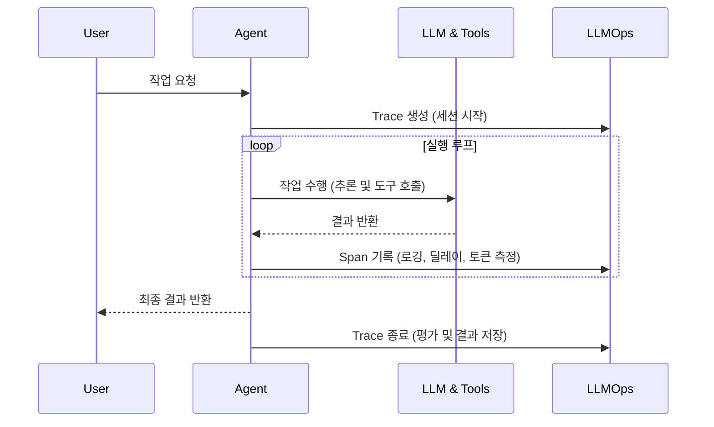

# LLMOps (LLM Observability & Operations)

LLM 애플리케이션, 특히 여러 단계로 사고하고 행동하는 **에이전트(Agent)** 는 비결정론적(Non-deterministic) 특성을 가지며 반복적인 루프를 돕니다. 때문에 기존 소프트웨어의 로깅 및 모니터링 방식만으로는 디버깅과 평가가 매우 어렵습니다.

이를 해결하기 위해 등장한 개념이 **LLMOps**(Large Language Model Operations)이며, 그 핵심 중 하나가 바로 **옵저버빌리티(Observability, 관측성)** 입니다.

### LLMOps 동작 시퀀스

에이전트 구동 시 LLMOps 플랫폼이 백그라운드에서 추적(Tracing) 및 모니터링을 수행하는 흐름은 다음과 같습니다.

에이전트를 안정적으로 구동하고 관리하려면, 다음과 같은 시스템들이 필수적으로 필요합니다.

1. **Tracing (추적 관리)**: 에이전트가 어떤 생각(Thought)을 통해 작동했고, 어떤 도구(Tool)를 어떻게 불렀는지 타임라인 및 트리 형태로 기록.
2. **Evaluation (오프라인/온라인 평가)**: 모델 및 에이전트의 답변 품질 측정 (LLM-as-a-Judge 도입).
3. **Cost & Metrics Monitoring**: 각 단계에서 발생하는 실시간 지연시간(Latency), 토큰 사용량, 비용 등 인프라스트럭처 수준 모니터링.
4. **Prompt Management**: 프롬프트를 버전 관리하고 A/B 테스트 환경 제공.

이 섹션에서는 이러한 에이전트 관리를 지원하는 대표적인 도구들의 특징과 활용 방법을 정리합니다.

---

## 주요 도구 살펴보기

* [Langfuse](./langfuse.md): 강력한 오픈소스 기반의 LLM 옵저버빌리티 도구.
* [LangSmith](./langsmith.md): LangChain 파운데이션에서 제공하는 긴밀하게 통합된 솔루션.
* [Arize Phoenix](./arize-phoenix.md): 에이전트 시각화 및 평가를 위한 오픈소스 도구.
* [Prometheus & Grafana](./prometheus-grafana.md): 프로덕션(Production) 환경의 인프라 및 리소스 메트릭 수집 및 대시보드 시각화.
