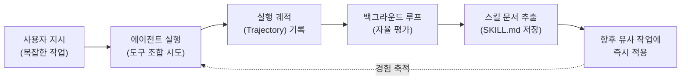

# Hermes Agent

## 개요

Hermes Agent는 실리콘밸리의 AI 연구소 **Nous Research**가 2026년 2월에 출시한 **인프라 우선(Infrastructure-first) 자율형 AI 에이전트** 프레임워크입니다. 출시 직후 두 달 만에 GitHub에서 85,000~95,000 Star를 획득하며 차세대 에이전트 표준으로 급부상했습니다.

단순한 코딩 보조 도구(Copilot)를 넘어, 클라우드 서버와 로컬 인프라에 **상주(Always-on)**하며 장기적인 워크플로우를 자율적으로 계획·실행·학습하는 **독립적인 자율 인프라**로 기능합니다.

## 주요 특징

- **인프라 독립성**: 특정 IDE나 웹 래퍼에 종속되지 않으며, 월 $5 수준의 VPS부터 GPU 클러스터, 서버레스 인프라(Daytona, Modal 등)까지 유연하게 배포 가능합니다.
- **멀티 플랫폼 게이트웨이**: 단일 게이트웨이 프로세스를 통해 CLI, Telegram, Discord, Slack, WhatsApp, Signal, Matrix, Email, SMS 등 **15개 이상의 메시징 및 제어 플랫폼**과 연동됩니다.
- **다중 모델 라우팅(Multi-Model Routing)**: OpenRouter를 통해 200개 이상의 모델을 지원하며, 단순 작업에는 저렴한 모델을, 복잡한 추론에는 고비용 모델을 교차 배정하여 **토큰 비용을 획기적으로 절감**합니다.
- **자가 학습 루프**: 사용할수록 강력해지는 폐쇄형 학습 루프(Closed Learning Loop)를 내장하여, 에이전트가 경험을 통해 스스로 업무 수행 방식을 최적화합니다.

---

## 아키텍처 심층 분석

### 1. 4계층 상호 의존적 메모리 아키텍처

대부분의 에이전트가 세션 종료 시 심각한 기억 상실증을 겪는 것과 달리, Hermes Agent는 정보의 성격에 따라 4개의 개별 계층으로 메모리를 관리합니다.

| 계층 | 명칭 | 역할 |
| :---: | :--- | :--- |
| **1** | **프롬프트 파일 (Prompt Files)** | 에이전트의 성격, 작동 범위, 제약 조건을 정적으로 규정 |
| **2** | **SQLite 아카이브** | 교차 세션(Cross-session) 대화 내역 및 메타데이터 저장. **FTS5**(Full-Text Search)와 LLM 요약을 결합하여 벡터 DB 없이 정확한 과거 검색 지원 |
| **3** | **동적 스킬 (Dynamic Skills)** | 성공적인 작업 절차를 `SKILL.md` 형태로 문서화하여 재사용 가능한 패키지로 저장. 관련 개념: [Agent Skills](../skills/index.md) |
| **4** | **사용자 모델링 (User Modeling)** | Honcho의 **변증법적 사용자 모델링**을 채택하여, 사용자의 선호도·커뮤니케이션 스타일을 백그라운드에서 추론 및 모델링 |

> 이 메모리 아키텍처의 이론적 배경은 [에이전트 메모리 관리](../agent/memory.md) 문서에서 더 자세히 확인할 수 있습니다.

### 2. 자율적 스킬 창출 파이프라인 (실행 → 평가 → 추출)

Hermes Agent의 핵심 차별점은 **스킬 자가 창출 프로세스**에 있습니다.

1. **실행(Execute)**: 사용자가 복잡한 작업을 지시하면 에이전트는 여러 도구를 조합하여 수행합니다.
2. **평가(Evaluate)**: 작업 완료 후, 백그라운드 루프가 실행 궤적(Trajectory)을 자율적으로 분석합니다. 어떤 추론 단계가 유효했고, 어떤 도구 호출 순서가 최적이었는지를 판단합니다.
3. **추출(Extract)**: 최적의 절차를 독립적인 스킬 문서로 추출하여 로컬에 저장합니다.

이 과정을 통해 에이전트는 사용자가 스킬을 수동으로 코딩하거나 마켓플레이스에서 설치할 필요 없이, **경험을 통해 업무 수행 방식을 자율적으로 규격화(Compounding)**합니다.

#### 학술적 근거: 전략적 유전자(Strategy Genes)

이 자가 학습 메커니즘은 2026년 4월 발표된 연구 *"From Procedural Skills to Strategy Genes"(arXiv:2604.15097)*에 이론적 기반을 두고 있습니다. 이 연구는 경험을 긴 문서 형태의 스킬(Skill)로 주입하면 고성능 모델에서 오히려 성능이 하락(Pro 모델 60.1%→50.7%)하는 반면, 핵심만 압축한 **전략적 유전자(Gene)** 형태로 인코딩하면 안정적으로 성능이 향상(전체 평균 51.0%→54.0%)됨을 정량적으로 입증했습니다.

| 모델 / 조건 | 기준선 (No Guidance) | 절차적 스킬 주입 | 전략적 유전자 주입 |
| :--- | :---: | :---: | :---: |
| Flash 모델 | 41.8% | 49.0% ↑ | 48.2% ↑ |
| Pro 모델 | 60.1% | **50.7% ↓** | 59.9% ≈ |
| **전체 평균** | 51.0% | 49.9% (-1.1%p) | **54.0% (+3.0%p)** |

### 3. 병렬 처리 및 샌드박싱

대규모 데이터 처리 시 단일 에이전트 스레드의 병목을 해결하기 위해, Hermes Agent는 **서브에이전트(Subagents)**를 동적으로 생성하여 작업을 병렬화합니다.

- 각 서브에이전트는 완전히 격리된 자체 대화 컨텍스트, 터미널, Python RPC 스크립트를 보유합니다.
- 메인 에이전트가 하위 작업을 위임함으로써 **컨텍스트 창 누수 및 토큰 비용 증가를 원천 차단**합니다.

#### 6개 터미널 백엔드 아키텍처

실행 안전성을 보장하기 위해 다음 6가지 격리 환경을 지원합니다:

| 백엔드 | 특징 |
| :--- | :--- |
| **Local** | 로컬 터미널에서 직접 실행 |
| **Docker** | 컨테이너 하드닝 및 네임스페이스 격리 |
| **SSH** | 원격 서버에서의 격리된 실행 |
| **Daytona** | 서버레스 개발 환경 |
| **Singularity** | HPC(고성능 컴퓨팅) 환경 지원 |
| **Modal** | 유휴 시 비용 미발생 서버레스 인프라 |

> Hermes Agent의 샌드박싱 아키텍처에 대한 보안적 맥락은 [동적 에이전트 보안 위협](../security/dynamic-agent-risks.md) 문서를 참고하세요.

---

## 기초 모델: Hermes 3 & Hermes 4

Hermes Agent의 백엔드에서 작동하는 파운데이션 모델로, Meta의 [Llama 3.1](../open_weight_models/llama.md) 아키텍처를 에이전트 구동에 최적화한 시리즈입니다.

| 비교 항목 | Hermes 3 (2024.08) | Hermes 4 (2025.08) |
| :--- | :--- | :--- |
| **훈련 데이터** | DPO/LoRA 기반 지시 튜닝 | 60B 토큰 추론 궤적 데이터셋 |
| **추론 방식** | 단일 패스 지시 이행 | `<think>` 태그를 통한 **하이브리드 추론** |
| **정렬 철학** | 중립적 정렬 | **무검열 중립 정렬** (RefusalBench SOTA) |
| **핵심 강점** | 안정적 JSON 구조화 출력, 병렬 도구 호출 | STEM/수학/복합 코딩 태스크 (LiveCodeBench 54.6%) |

특히 **Hermes 4**는 에이전트가 수백 단계를 오케스트레이션할 때 사소한 안전 필터로 인해 실행이 거부되는 문제를 해결하기 위해, 검열 없는 사용자 지시 이행 능력을 극대화한 점이 특징적입니다.

---

## 경쟁 프레임워크 비교

| 비교 항목 | Hermes Agent | [OpenClaw](./open_claw.md) | Claude Code |
| :--- | :--- | :--- | :--- |
| **주요 목적** | 지속적·자율적 반복 워크플로우 및 자가 개선 | 단발성 태스크의 자연어 직접 실행 | 터미널/IDE 내 개발 워크플로우 전담 |
| **토큰 비용 (5일 평균)** | ~$10 (다중 모델 라우팅) | ~$130 | - |
| **생태계** | ~40+ 내장 도구 및 커뮤니티 스킬 | 44,000+ 스킬 (ClawHub) | 개발자 환경 최적화 |
| **보안** | 격리된 샌드박스 및 서브에이전트 구조 | 시스템 깊은 접근성 (CVE 이슈 다수) | 로컬 폴더 스코프 종속 |
| **추천 시나리오** | 반복 리서치, 장기 모니터링, 백그라운드 파이프라인 | 일상 보조(이메일, 일정), 광범위 앱 통합 | 코드 개발, 디버깅 |

> 2026년 커뮤니티 여론 분석에 따르면, 약 20%의 사용자가 OpenClaw를 메인 오케스트레이터로, Hermes를 자가 학습 서브 모듈로 **병행 사용하는 하이브리드 전략**을 채택하고 있습니다.

---

## 오픈소스 라이선스와 AI 코드 세탁 이슈

Hermes Agent의 자가 진화 모듈은 중국 EvoMap 팀의 오픈소스 엔진 **Evolver**와의 아키텍처 수준 표절 논란에 휘말렸습니다. 이 사건은 AI 시대의 **'코드 세탁(AI Code Washing)'** 문제를 대표하는 사례로 기록되었습니다.

- **핵심 쟁점**: 언어(Node.js → Python)만 다를 뿐, 10단계 핵심 루프의 실행 순서, 12개 그룹의 용어 치환, 세부 설계 패턴이 동일
- **결과**: EvoMap은 MIT → **GPL-3.0** 라이선스 변경 및 코드 난독화로 전환
- **시사점**: LLM 기반의 로직 구조 복제가 기존의 문자열 기반 표절 검사를 무력화하며, 소규모 개발자의 오픈소스 기여 의지를 약화시킬 수 있음
