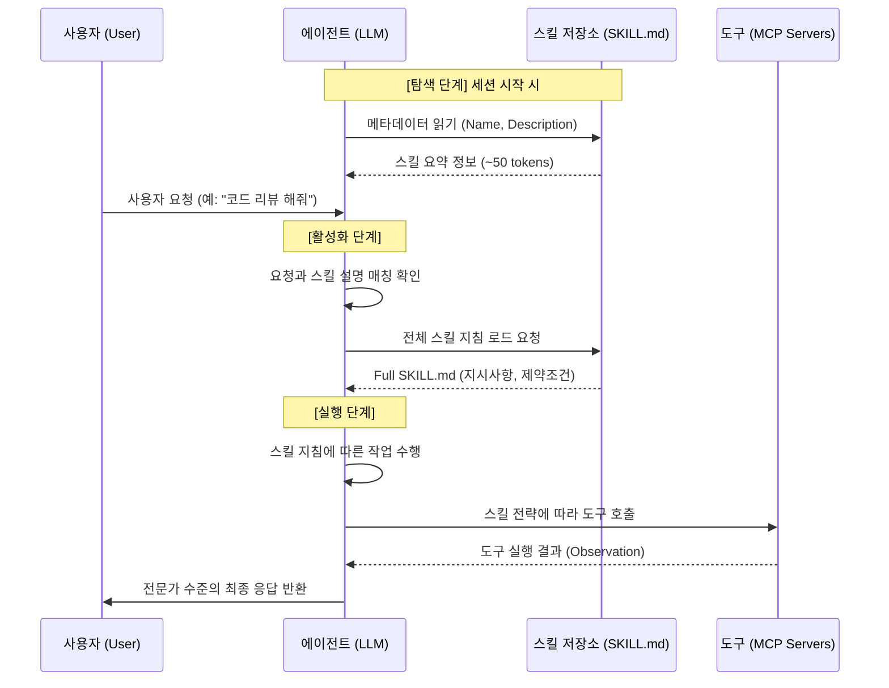

# 스킬의 개념과 원리 (How it Works)

## 1. 지식의 분류: 도구(Tools) vs 스킬(Skills)
에이전트가 목표를 달성하기 위해 사용하는 두 가지 주요 자원은 서로 다른 역할을 합니다.

- **도구 (Tools/MCP)**: 에이전트가 외부 세계와 상호작용하기 위한 **'장비'**입니다. (예: "Slack 메시지 전송", "GitHub 이슈 생성", "PostgreSQL 쿼리 실행")
- **스킬 (Skills/SKILL.md)**: 에이전트가 특정 작업을 성공적으로 수행하기 위한 **'노하우'**입니다. (예: "효과적인 PR 리뷰 방법", "보안 감사 체크리스트", "성능 최적화 가이드라인")

즉, **MCP는 "What can I do"**를 정의하고, **Agent Skills는 "How should I do it"**을 정의합니다.

## 2. 점진적 공개 모델 (Progressive Disclosure)
에이전트의 컨텍스트 윈도우는 소중한 자원입니다. 모든 지식을 한꺼번에 주입하면 모델이 주의력을 잃거나(Distraction) 비용이 급증합니다. Agent Skills는 이를 해결하기 위해 3단계 로딩 방식을 사용합니다.

1. **탐색 (Discovery)**: 세션 시작 시, 에이전트는 등록된 모든 스킬의 `name`과 `description`만 읽습니다. (매우 적은 토큰 소모)
2. **활성화 (Activation)**: 사용자의 요청이 특정 스킬의 설명과 일치할 때, 에이전트는 해당 스킬의 `SKILL.md` 전체 내용을 로드합니다. 이때 상세한 지시사항이 에이전트의 '작업 지침'에 추가됩니다.
3. **심층 분석 (Deep Dive)**: 에이전트가 작업을 수행하다가 스킬 폴더 내의 특정 참조 파일(`references/`)이나 데이터가 필요할 때, 직접 그 파일을 읽어옵니다.

## 3. 작동 시퀀스 다이어그램 (Sequence Diagram)

## 4. 스킬의 트리거 (Triggering)
에이전트는 사용자의 질문이나 현재 작업의 문맥을 분석하여 어떤 스킬이 필요한지 스스로 판단합니다.
- **예시**: 사용자가 "이 코드의 보안 취약점을 점검해줘"라고 요청하면, 에이전트는 자신의 스킬 리스트 중 `description: "보안 취약점 점검을 위한 전문적인 워크플로우를 제공합니다."`를 가진 `security-audit` 스킬을 활성화합니다.
