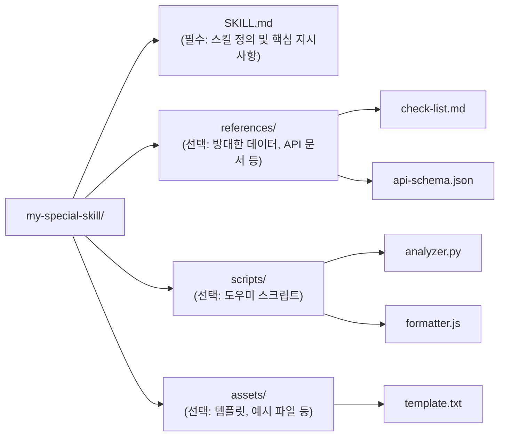

# 스킬 구조 및 관리 (Directory Structure)

하나의 스킬은 단순한 파일 하나가 아니라, 관련된 모든 지식과 도구가 결합된 **디렉토리(폴더)** 단위로 관리됩니다.

## 1. 표준 디렉토리 레이아웃
권장되는 스킬 폴더의 구조는 다음과 같습니다.

## 2. 각 구성 요소의 역할
- **SKILL.md**: 에이전트가 스킬을 활성화하자마자 읽는 '작업 지시서'입니다.
- **references/**: 에이전트가 `SKILL.md`를 읽은 후, 구체적인 데이터가 필요할 때 읽어오는 '참고 서적'입니다. 방대한 양의 데이터를 여기에 두어 초기 로딩 시 토큰을 절약합니다.
- **scripts/**: 에이전트가 직접 수행하기 복잡한 계산이나 정형화된 작업을 돕기 위해 제공하는 '전용 도구'입니다. 에이전트는 필요 시 이 스크립트를 실행하여 결과를 얻습니다.

## 3. 스킬 관리 전략
- **중앙 관리**: 팀 공용 스킬 저장소를 만들어 `git submodule` 등으로 여러 프로젝트에서 공유합니다.
- **버전 관리**: `SKILL.md`의 YAML 부분에 버전을 명시하여 업데이트 이력을 관리합니다.
- **테스트**: 특정 입력에 대해 에이전트가 올바른 스킬을 활성화하고 지침을 따르는지 확인하는 '스킬 테스트 시나리오'를 운영합니다.
