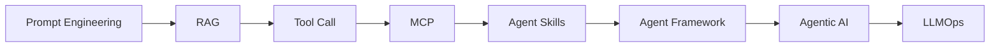
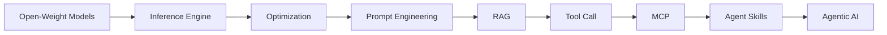
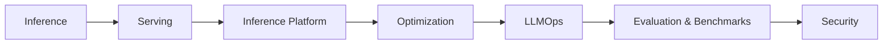
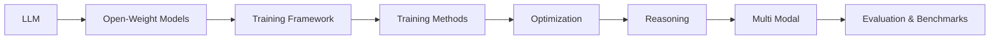
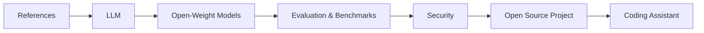

# All About LLM

LLM 서비스를 구축하기 위해 알아두면 좋은 지식들을 모아두는 공간입니다.

이 문서는 LLM(대형 언어 모델) 관련 핵심 개념, 실전 적용 방법, 최신 오픈소스 프로젝트 등을 정리하여, 입문자와 실무자 모두에게 도움이 되도록 구성되었습니다.

## 독자별 추천 읽기 순서

LLM 생태계의 다양한 역할에 맞추어, 어떤 순서로 문서를 확인하면 좋을지 안내해 드립니다.

### 1. API 기반 AI 애플리케이션 개발자
OpenAI, Anthropic 등 SaaS API를 활용해 빠르게 서비스나 자율 에이전트를 구축하는 분들을 위한 순서입니다.

### 2. 로컬 LLM 기반 애플리케이션 개발자
Llama, DeepSeek 등 오픈 웨이트 모델을 로컬 환경에 직접 구축하고 최적화하여 독자적인 서비스를 운영하려는 분들을 위한 순서입니다.

### 3. MLOps 및 서빙 엔지니어
학습된 모델을 프로덕션 환경에 최적화하여 배포하고 운영하는 분들을 위한 순서입니다.

### 4. 모델 연구원 및 엔지니어
새로운 파운데이션 모델을 학습시키거나 파인튜닝하는 연구 개발자를 위한 순서입니다.

### 5. PM 및 IT 기획자
LLM 기반 비즈니스를 기획하거나 기술 트렌드를 읽으려는 리더를 위한 순서입니다.

## 목차

- [LLM](./docs/LLM/) - 대형 언어 모델의 기본 개념과 구조
- [오픈 웨이트 모델 (Open-Weight Models)](./docs/open_weight_models/) - Llama, DeepSeek 등 주요 오픈 웨이트 모델 소개
- [Training Methods](./docs/training_methods/) - LLM 학습 방법론 및 기법
- [Training Framework](./docs/training_framework/) - 학습 프레이트워크 및 도구 소개
- [Optimization](./docs/optimization/) - 모델 성능 최적화 전략
- [Inference](./docs/inference/) - LLM Inference 기법
- [Serving](./docs/inference_engine/) - LLM 서비스 배포 및 운영 방법
- [추론 플랫폼 (Inference Platform)](./docs/inference_platform/) - LLM 추론 서비스를 제공하는 외부 플랫폼 비교
- [Prompt Engineering](./docs/prompt_engineering/) - 효과적인 프롬프트 설계 방법
- [RAG](./docs/RAG/) - 검색 기반 생성(Retrieval-Augmented Generation) 기법
- [Tool Call](./docs/tool_call/) - 외부 도구 연동 및 호출 방법
- [MCP (Model Context Protocol)](./docs/mcp/) - 모델과 외부 도구 간의 표준화된 인터페이스 프로토콜
- [Context Engineering](./docs/context_engineering/) - 컨텍스트 관리 및 확장 기법
- [Reasoning](./docs/reasoning/) - LLM의 추론 및 논리적 사고 적용
- [Multi Modal](./docs/multi_modal/) - 멀티모달(텍스트+이미지 등) 모델 활용
- [Agent](./docs/agent/) - LLM 기반 에이전트 설계 및 활용
- [Agentic AI](./docs/agentic_ai/) - 자율적 사고와 도구 활용 시스템 패러다임
- [Agent Framework](./docs/agent_framework/) - 에이전트 구축을 위한 프레임워크(LangGraph, CrewAI 등)
- [Agent Skills](./docs/skills/) - 에이전트의 구체적인 작업 수행 능력 및 구현
- [Agentic Coding Assistant](./docs/coding_assistant/) - 자율형 코딩 에이전트 및 도구 활용
- [Agent Harness](./docs/agent_harness/) - 에이전트 성능 측정 및 평가 프레임워크
- [LLMOps](./docs/llmops/) - LLM 서비스의 생명주기 관리 및 운영
- [Evaluation](./docs/evaluation/) - 모델 성능 평가 및 개선
- [Security](./docs/security/) - LLM 보안 및 정렬 (Jailbreak, Guardrails 등)
- [Open Source Project](./docs/open_source_project/) - 주요 오픈소스 프로젝트 소개
- [References (참조 자료)](./docs/references/) - LLM 관련 유용한 논문, 블로그, 도구 모음
- [개발 가이드](./docs/development.md) - 프로젝트 기여 및 로컬 개발 환경 설정 가이드
